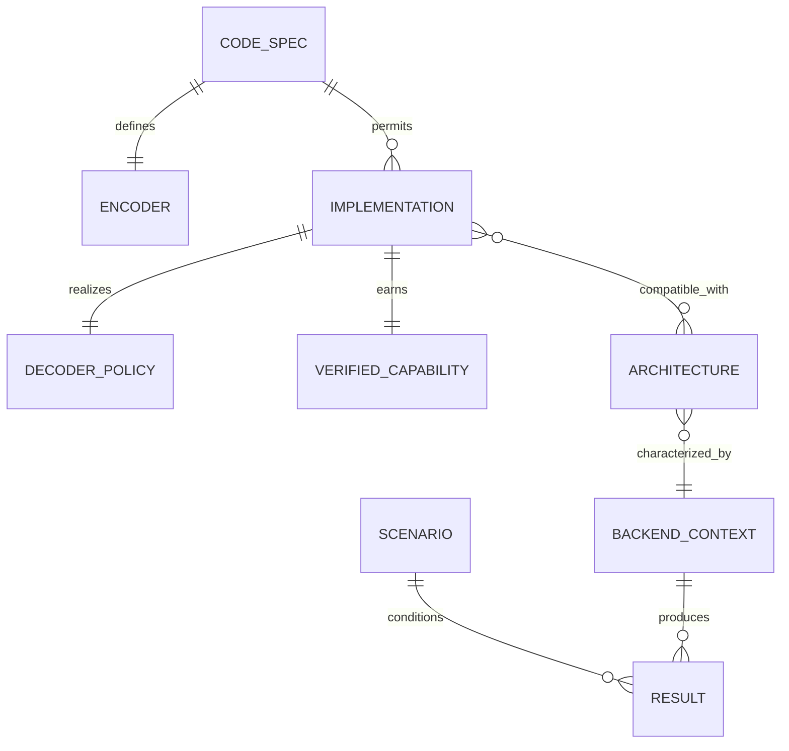
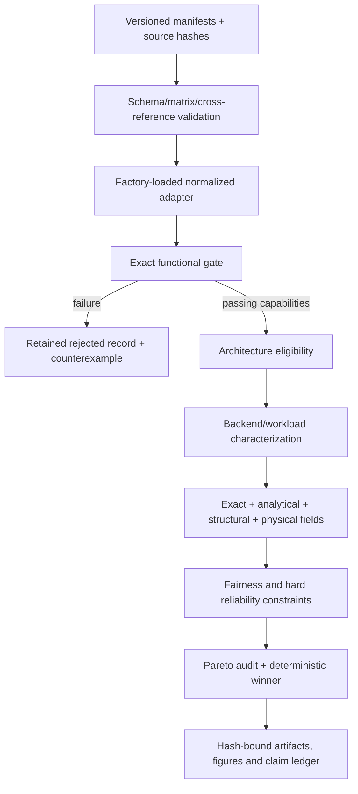
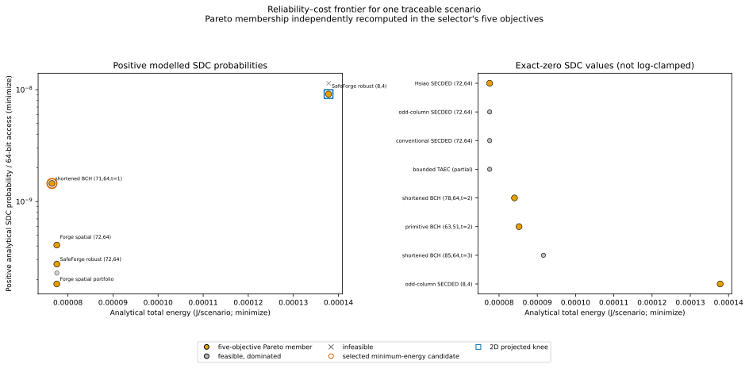

# GREEN-ECC-PHY technical guide

## Abstract

GREEN-ECC-PHY is an evidence-gated research framework for error-correcting code (ECC) integration and comparison. Its central research question is: **when ECCs differ in mathematical code, decoder policy and deployment architecture, which choices satisfy a scenario's verified reliability constraints, and what trade-offs appear under explicit energy/carbon models—without misrepresenting proxies as physical measurements?**

The framework answers by separating identity, verification, characterization, fairness and selection. Mathematical code specifications own codeword sets; implementations own encoder/decoder behavior; exact tests establish capabilities; architectures own placement and adaptation obligations; backend contexts own physical meaning; workloads/scenarios own assumptions; and every result carries an evidence class. Negative results and null fields remain visible.

This guide is self-contained for thesis and artifact review. The maintainable topic sources are under [`docs/`](docs/index.md), and all quantitative findings are regenerated rather than copied from historical prose.

## 1. Current evidence and conclusions

<!-- BEGIN GENERATED:CURRENT_GUIDE_STATUS -->
The regenerated registry contains **15 code specifications**, **17 implementations**, **17 architectures**, and **15 selectable implementations**. The current analytical grid evaluates **192 scenarios**, of which **192** have a feasible winner.

The defensible evidence ceiling is exact functional execution plus an explicitly parameterized analytical sensitivity model. Generic structural evidence exists, but every physical area, timing, energy, routing, MUX/controller, transition, and re-encoding objective remains null. Consequently, the physical-capability gate fails and no physical winner is claimed.
<!-- END GENERATED:CURRENT_GUIDE_STATUS -->

The evidence taxonomy is:

| Class | Meaning | Current availability |
|---|---|---|
| `exact_functional` | Algebraic checks or exact/exhaustive decoder execution | Available |
| `analytical_model` | Equation/model output from explicit parameters | Available |
| `structural_tool` | Generic synthesis or technology-independent structure | Partially available |
| `physical_characterization` | PDK/library/corner/workload-bound area, timing, power, energy or routing | Unavailable |
| `hardware_measurement` | Instrumented board/silicon result | Unavailable |
| `unsupported` | Null, absent, excluded or not computable | Explicitly represented |

The strongest supported result is functional and methodological: multiple distinct verified implementations win different preregistered analytical scenario regions, fixed baselines have non-zero analytical regret, and recommendations are stable under two of three named sensitivity cases. The strongest negative result is that the physical capability gate fails: no physical winner, implementation PPA comparison, measured MUX/controller overhead, or actual adaptive break-even can be claimed.

## 2. Appropriate use

GREEN-ECC-PHY is suitable for validating a new encoder/decoder, comparing policies that share one mathematical code, comparing distinct codeword sets at equal payload, finding silent miscorrection, checking scenario reliability limits, studying analytical selection/regret/stability, teaching reproducible ECC evaluation, preparing RTL for future physical characterization, and reproducing the software study.

It must not be used as measured physical PPA, silicon reliability, radiation qualification, technology independence, qualified-device reliability data, measured adaptive overhead, or proof that a family label guarantees correction. Generic Yosys cells and logic-depth counts are not physical area or delay.

## 3. Identity model

```text
mathematical code specification
  -> encoder/codeword set
    -> decoder implementation/policy
      -> verified capability
        -> deployment architecture
          -> backend + PDK/library + corner
            -> workload + scenario
              -> evidence-gated result
```

| Identity | Responsibility |
|---|---|
| `code_spec_id` | GF(2) construction, `(n,k)`, matrices/polynomial, shortening/puncturing and distance evidence |
| `encoder_id` | Exact mapping from information to codeword |
| `implementation_id` | Concrete adapter/reference/RTL, protocol, latency and evidence |
| `decoder_policy_id` | Syndrome-to-correction/detection/abstention rule |
| capability class | Tested universe, acceptable statuses and exact result |
| `architecture_id` | Fixed/configurable/adaptive placement and architecture-owned overhead |
| `backend_id` | Tool/technology/corner evidence context |
| `workload_id`/`scenario_id` | Activity and environment/requirement assumptions |

Conventional SECDED, bounded SEC-DAEC and bounded TAEC share `extended-hamming-secded-72-64-v1`; changing a syndrome policy does not change the codeword set. They are nevertheless separate implementations, and their evidence differs. A distinct `(75,64)` TAEC matrix would be a separate code specification. Hsiao `(72,64)` and positional extended-Hamming `(72,64)` remain distinct because no coordinate-equivalence proof is present. Equal dimensions are insufficient.

The rejected cyclic/BCH-labelled `(63,51)` implementation remains catalogued: it corrects 30/63 single masks and silently miscorrects 33/63, with exact minimum distance two. It cannot inherit the guarantee of the valid primitive BCH `(63,51,t=2)` reference, which passes its declared weight-two universe. A test-only `(3,1)` repetition plugin demonstrates the extension contract but is absent from scientific counts.



## 4. Framework architecture

`green_ecc_phy/contracts.py` defines `DecodeResult`, `DecodeStatus` and the adapter protocol. `registry.py` validates Draft 2020-12 schemas, hashes, matrix shape/rank/orthogonality and cross-references; `loading.py` resolves external callables. `adapters.py` and `bch.py` normalize code families. `verification.py` executes evidence gates. `backends.py` writes null-safe characterization records. `comparison.py` constructs fairness views and physical-only selection. `study.py` builds exact profiles, structural proxies, scenario metrics, Pareto sets, winners, regret and uncertainty cases. Documentation Pareto validation is independently implemented in `pareto_validation.py`.



Fixed architectures deploy one implementation without runtime transition. Configurable gated-parallel designs own multiple datapaths plus MUX/controller. Adaptive shared-datapath designs additionally own policy, state transition and possible re-encoding. Placement may be whole-memory, bank or page. Current manifests describe these obligations but do not measure their physical costs.

## 5. Installation

Continuous integration tests Ubuntu with Python 3.10–3.12 and Windows with Python 3.11/MSYS2. The full baseline requires Python 3.10–3.12, packages in `requirements.txt`, GNU Make, Git and a C++17 compiler. Icarus Verilog, Verilator and Yosys are optional RTL/structural tools. Physical flows additionally require their exact tool, PDK, standard-cell/memory libraries, corners, constraints and activity; none is installed automatically.

Windows PowerShell:

```powershell
python -m venv .venv
.\.venv\Scripts\Activate.ps1
python -m pip install -r requirements.txt
python eccsim.py doctor --json
```

Bash/WSL:

```bash
python3 -m venv .venv
source .venv/bin/activate
python -m pip install -r requirements.txt
python eccsim.py doctor --json
```

Verify with `python eccsim.py ecc list`, `make`, and `python -m pytest -q`. Optional-tool absence produces warnings/unavailable backends and null metrics; it must never silently choose a substitute. The local rebuild found Icarus Verilog and Yosys, but also an environment-specific Windows C++ runtime-order error and an unreadable Verilator launcher. This does not invalidate Python catalogue/verification, but `doctor --strict` should fail until a required runtime error is corrected.

## 6. End-to-end workflows

### 6.1 Inspect the catalogue

```text
python eccsim.py ecc list
python eccsim.py ecc inspect --code hsiao-secded-72-64-v1
python eccsim.py ecc implementations --code extended-hamming-secded-72-64-v1
```

`list` reports current code/implementation counts and `(n,k)` summaries. `inspect` expands matrix/distance evidence, encoder/decoder policy, correction/detection sets, hashes and provenance. `implementations` demonstrates one code with three policies. Every path is relative to the repository root; the live output may contain a local registry path, but published documentation does not rely on it.

### 6.2 Verify one implementation

```text
python eccsim.py ecc verify --implementation hsiao-generated-combinational-72-64-v1
python eccsim.py ecc verify --implementation secdaec-rtl-bounded-72-64-v1
```

The first passes 72/72 single errors and 2,556/2,556 doubles in its declared SECDED universe. The second produces a valid negative report: 302/2,556 double errors and 53/63 adjacent data-pairs silently miscorrect. A zero process exit means a report was generated; scientific pass/fail is in `verification_status`, `capability_verification_status` and each class record.

The gate also checks deterministic/no-error behavior, malformed inputs, latency, required protocol/reset/transition evidence, hash-bound RTL/reference evidence, implementation/matrix hashes, tested-data words and a tested-universe hash. Failed masks are counterexamples. Partial verification means passing capabilities survive while failed implementation claims do not; bounded TAEC is the current example.

### 6.3 Run the complete evaluation

```text
python scripts/build_multi_ecc_catalogue.py
python scripts/run_multi_ecc_framework_evaluation.py
```

Outputs under `green_ecc_physical_simulation/multi_ecc_evaluation/` include per-implementation verification and characterization, scope/capability/architecture matrices, normalized exact metrics, exact error profiles, scenario candidate decisions, Pareto/regret, uncertainty/sensitivity, physical selection and framework summaries. Each artifact is deterministic JSON with canonical hashes where defined.

### 6.4 Characterize an implementation

```text
python eccsim.py characterize --implementation hsiao-generated-combinational-72-64-v1 --architecture fixed-hsiao-whole-memory-v1 --backend green_ecc_physical_simulation/registry/backends/structural-yosys-local-v1.json --workload green_ecc_physical_simulation/registry/workloads/functional-uniform-placeholder-v1.json --outdir tmp/characterization
```

Verification must pass and the architecture must permit the implementation. The local backend produces generic structural evidence only. `cell_area`, `critical_path`, physical energies, routing, MUX/controller, transition and uncertainty stay null. A candidate becomes physically comparable only when a backend binds real tools, PDK/library/corner, constraints, workload/activity and metric extraction provenance.

### 6.5 Run selection

The current normalized analytical path is the complete evaluation script. It filters verification, uses exact error profiles, applies scenario SDC/DUE limits, computes a five-objective frontier and selects the lexicographic minimum `(analytical total energy, structural complexity, encoded bits, implementation_id)`.

Physical selection is a separate strict path:

```text
python eccsim.py select-physical --characterization green_ecc_physical_simulation/multi_ecc_evaluation/characterization --scenario green_ecc_physical_simulation/registry/scenarios/no-physical-selection-v1.json --outdir tmp/physical-selection
```

Current correct output: `candidate_count: 0`, `winner: null`. Legacy `eccsim.py select`, `target`, `evaluate`, SRAM and family models remain backward compatible but use aliases/surrogates that do not map one-to-one to the normalized implementation chain; their winners are not directly comparable.

### 6.6 Add a new ECC

1. define a schema-valid code manifest with unique code/encoder identity;
2. provide explicit `G`/`H`, deterministic matrix generator or bound polynomial/shortening definition;
3. implement an adapter returning `DecodeResult`;
4. define an implementation manifest with unique decoder policy;
5. declare correction/detection universes and acceptable statuses;
6. bind source/matrix/manifest/evidence hashes;
7. define compatible architecture and ownership of metadata/MUX/controller/transitions;
8. add relative paths to a registry;
9. build and inspect the catalogue;
10. verify and archive counterexamples;
11. characterize only after passing;
12. regenerate comparison/selection;
13. add deterministic regression tests.

Factories use `module:callable` or `file.py::callable`; relative files resolve from the manifest directory. The latter form is proven by `tests/fixtures/multi_ecc_external/plugin.py`. Loader errors explicitly report missing separator, file or non-callable attribute. Registry errors report duplicate IDs, schema violations, broken hashes, invalid matrix shape/rank/orthogonality and unknown cross-references.

## 7. Mathematical and analytical models

### 7.1 Code and syndrome

For `(n,k)`, rate and redundancy are

\[
R=k/n,\qquad r=n-k.
\]

`R` is dimensionless and `r` bits/codeword; both are exact registry facts. `(72,64)` has `R=0.888888…`, `r=8`, and encodes a 64-bit payload in 72 bits. For payload `B`, equal-payload normalization uses `ceil(B/k)` codewords, `n ceil(B/k)` encoded bits and `k ceil(B/k)-B` pad bits.

For received vector `y` and parity-check matrix `H`, syndrome `s=Hy^T mod 2`. A syndrome has no correction meaning without the bound decoder policy.

### 7.2 Exact outcome profiles and residual risk

For exact error class `c`, the verification fraction is the number of masks producing an outcome divided by the class size. Under scenario class probabilities `p_c`,

\[
p_{o,cw}=\sum_c p_c f_{c,o},\qquad p_{o,64}=1-(1-p_{o,cw})^{\lceil64/k\rceil}.
\]

The fractions are exact; the PMF combination is analytical. Outcomes distinguish correctly restored data, detected/abstained uncorrectable errors and silent data corruption (SDC).

### 7.3 Reliability, MBU and scrubbing

The legacy Hazucha–Svensson-style model is

\[
FIT_{node}=C\Phi_{rel}A_{sens}e^{-Q_{crit}/Q_s},
\]

with relative flux, µm² sensitive area and femtocoulomb charge terms. It is fitted/analytical, not a radiation result. The multi-bit upset (MBU) module provides tunable adjacent/non-adjacent two-/three-bit PMFs. Legacy scrubbed residual FIT adds uncovered instantaneous MBU rates to accumulated independent doubles proportional to `choose(w,2) λ1² τ`. Family-level coverage in the legacy model must not override exact rejected implementations.

### 7.4 Energy and carbon

The multi-ECC model uses `V²`-scaled bit/XOR energies, exact encoded-bit/operation counts, workload accesses, stored encoded bits, a configured temperature leakage multiplier, and scrub passes:

\[
E_{total}=E_{dynamic}+E_{leakage}+E_{scrub},\qquad
C_{op}=E_{total}CI/(3.6\times10^6).
\]

Energy is J/scenario; carbon intensity is kgCO₂e/kWh; output is kgCO₂e/scenario. Embodied carbon would be `Alogic αlogic + Amacro αmacro`, but physical areas are unavailable, so current figures show operational carbon only.

ESII (Environmental Sustainability Improvement Index) is a bounded `[0,1]` product of reliability improvement and energy/carbon utilities. GS (Green Score) is a `[0,100]` weighted geometric mean of active bounded reliability, carbon, latency and overhead utilities. NESII is ESII normalized to a reference cohort using 5th/95th percentile anchors. These legacy metrics are analytical and are not the multi-ECC winner rule.

### 7.5 Notation and evidence

| Symbol | Unit | Evidence/assumption |
|---|---|---|
| `n,k,r` | bits | exact manifest |
| `f_c,o` | fraction | exact tested universe |
| `p_c`, `p_SDC`, `p_DUE` | probability/access | analytical PMF from exact fractions |
| FIT | failures/10⁹ h | analytical unless measurement bound |
| `E_dynamic`, `E_leakage`, `E_scrub` | J/scenario | analytical |
| `CI`, `C_op` | kgCO₂e/kWh, kgCO₂e/scenario | analytical input/output |
| depth/complexity | technology-independent proxy | structural-only |
| physical PPA | technology units | currently null |

## 8. Scenarios, fairness and selection

The preregistered grid combines 0.8/1.0 V, 25/85 °C, 1/3,600 s scrub intervals, 0.1/0.7 kgCO₂e/kWh, three fault profiles, two workloads and two reliability requirements: 192 scenarios. Fault PMFs are explicit uncalibrated sensitivity profiles; workloads are access-count/write-fraction abstractions; neither is hardware measurement.

Fair comparison views hold equal data width, codeword width, redundancy, information capacity, verified reliability domain, workload, timing target or area budget—or hold code/implementation fixed while varying policy, architecture or corner. Selection uses equal 64-bit payload and equal useful storage capacity.

Hard filters precede dominance: verification → fairness/context → SDC/DUE limits → finite/non-null objectives. The frontier minimizes SDC, DUE, analytical total energy, encoded bits and structural decoder complexity. For minimization, `a` dominates `b` if it is no worse in all objectives and strictly better in at least one. Current epsilon is zero; distinct duplicate points coexist.

Crowding distance is normalized neighbor spacing within a front. The plotted two-objective knee is the maximum normalized distance from the extreme-point chord. Hypervolume uses an explicitly stored reference point 5% worse than the plotted maxima. None of these overrides the lexicographic winner rule.

The documentation's independent Pareto implementation checks all 192 recorded frontiers exactly and tests dominated/equal points, mixed directions, nulls, rejected/infeasible/empty/singleton sets, epsilon boundaries, crowding, knee and hypervolume.



*Orange is analytical and frontier membership is independently recomputed; grey candidates are dominated and crosses infeasible. Source data and objective audit: [`docs/figure_data/reliability_cost_pareto_analytical.json`](docs/figure_data/reliability_cost_pareto_analytical.json).*

A physical Pareto frontier is not computable while all physical objectives are null.

## 9. Current results

Fresh evaluation records 192 feasible scenarios and no no-winner analytical cases. Winner counts are: Hsiao `(72,64)` 64; SafeForge robust `(72,64)` 32; shortened BCH `(71,64,t=1)` 32; shortened BCH `(78,64,t=2)` 32; and shortened BCH `(85,64,t=3)` 32. Exact values are in [`software_study_summary.json`](green_ecc_physical_simulation/multi_ecc_evaluation/software_study_summary.json).

The conventional SECDED fixed baseline is feasible in 96 scenarios and has mean analytical fractional regret about 2.499% there; Hsiao is feasible in 96 with about 0.459%; the strongest verified shortened BCH `(85,64,t=3)` is feasible in all 192 with about 21.937% mean fractional energy regret. Infeasible baseline scenarios are reported separately.

Base and storage-dominated sensitivity cases agree with all 192 base winners; logic-dominated agrees in 190/192. These are deterministic scale cases, not statistical confidence. The gross analytical oracle advantage over the best single fixed candidate is about 0.0111846515 J across comparable scenarios. That is the maximum total hypothetical adaptation overhead, not a measured break-even.


*Mathematical code, implementation/policy and architecture remain distinct. Data: [`docs/figure_data/winner_frequency_by_identity.json`](docs/figure_data/winner_frequency_by_identity.json).*

Negative results define the limits: SEC-DAEC is rejected; bounded TAEC's adjacent-triple claim fails; the historical cyclic/BCH-labelled candidate is rejected; all physical fields are null; proxy-to-physical reversal, PPA comparison and adaptive feasibility are not computable. No historical “27% energy” or “19% carbon” claim is supported by this regenerated study.

## 10. Reproducibility

The complete documentation, evaluation and figures are reproduced by:

```text
python scripts/build_documentation.py
```

Non-mutating validation is:

```text
python scripts/build_documentation.py --check
```

The builder regenerates catalogue/evaluation, creates 17 figures in SVG/320-DPI PNG/PDF, writes plot-ready JSON/CSV, updates marked sections, validates Markdown links/images, JSON examples, JSON/CSV files, figure/source hashes and CLI help, and emits `docs/figure_data/documentation_build_summary.json`. Figure creation fixes ordering/style/SVG salt/metadata; `--check` regenerates into a temporary directory and compares bytes.

Full project validation remains:

```text
make
make test
python -m pytest -q
```

The authoritative order is executable source, schemas/manifests, tests/evidence, freshly regenerated artifacts, provenance-valid archived logs, then documentation. Historical documentation under `docs/archive/pre_rebuild_2026-08-04/` is not consumed.

## 11. Limitations and claim discipline

Supported claims must be confined to exact registered identities, declared/tested universes and explicit analytical assumptions. Conditional claims must name the scenario grid/model. Structural claims must say “structural-only.” Unsupported/null physical claims must say “not computable,” not “zero.”

Future physical work must bind real implementation netlists, architecture overhead, memory macro/PDK/library/corners, timing constraints, routed extraction, activity, process/tool versions, and uncertainty. Future hardware/radiation work must add instrument, board/silicon, environmental and campaign provenance. Until then, the defensible result is an extensible exact-functional and analytical comparison framework—not a silicon sign-off result.

For citation-ready status, consult [`docs/CLAIM_LEDGER.md`](docs/CLAIM_LEDGER.md); for every plot's question, caption, source and hashes, consult [`docs/FIGURE_INDEX.md`](docs/FIGURE_INDEX.md).
