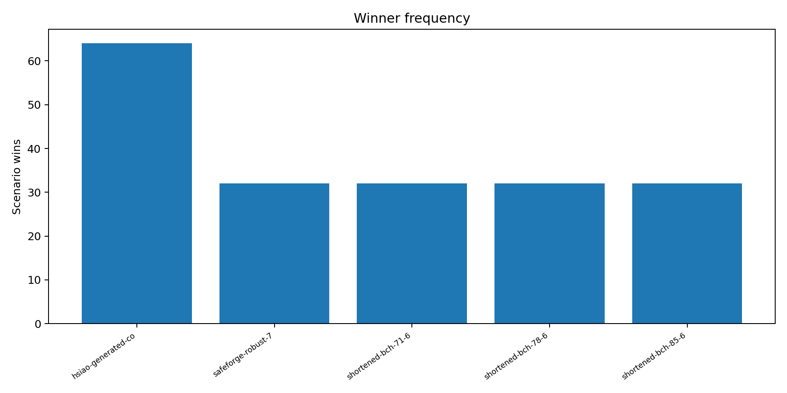

# GREEN-ECC-PHY multi-ECC framework report

## Outcome

GREEN-ECC-PHY now registers 15 distinct mathematical code specifications and 17 encoder/decoder implementations. Fifteen implementations are selectable after exact functional verification; two remain visible and rejected. The framework/extensibility gate and the functional/analytical software-simulation gate pass. The physical-scientific-result gate remains failed.

The reproducible 192-scenario grid produces five winners. Under the preregistered sensitivity model, different verified implementations win different fault/reliability regions and fixed baselines incur non-zero regret. The supported conclusion is therefore conditional: **scenario-aware ECC choice is supported inside this exact-functional plus analytical-sensitivity software model.** It is not a physical-PPA, silicon, measured-energy, or technology-independence conclusion.

## Catalogue and identity separation

The framework records the full chain independently:

```text
code_spec_id -> encoder_id -> implementation_id -> decoder_policy_id
  -> verified capability -> architecture_id -> scenario -> evidence-gated result
```

The 15 registered specifications comprise Hsiao and conventional extended-Hamming codes, the preserved invalid cyclic candidate, a valid primitive BCH (63,51,t=2), three valid shortened 64-information-bit BCH codes, and eight distinct archived SafeForge/CodeForge matrices. The human and machine scope matrices also classify grouped generated RTL, Polar models, C/C++ simulators, TAEC/SEC-DAEC variants, the repetition fixture, literature-only LDPC/Reed–Solomon mentions, and legacy family aliases.

The full inventory is [ECC_SCOPE_MATRIX.md](green_ecc_physical_simulation/multi_ecc_evaluation/ECC_SCOPE_MATRIX.md), backed by [ecc_scope_matrix.json](green_ecc_physical_simulation/multi_ecc_evaluation/ecc_scope_matrix.json). Hsiao-versus-positional extended-Hamming equivalence remains unestablished. Common dimensions or family names are not treated as equivalence evidence.

## Valid and rejected BCH identities

The historical RTL candidate remains `repository-cyclic-63-51-v1`. Its exact minimum distance is two; its bounded decoder corrects 30/63 single-bit masks and silently miscorrects 33/63. It remains rejected and cannot enter selection.

The new `primitive-bch-63-51-t2-v1` is separate. It uses GF(2^6) with primitive polynomial `x^6+x+1` (`0x43`), constructs roots alpha^1 through alpha^4 and generator polynomial `1010100111001`, and obtains the exact minimum distance five by dual enumeration plus the binary MacWilliams transform. Its deterministic GF-syndrome locator corrects all 63 single and all 1,953 double masks: 2,016/2,016.

The same generic construction proves shortening by fixing omitted parent information coordinates to zero:

| Code | Parent | Result | Bound/exact distance | Exhaustive correction |
|---|---|---|---|---:|
| shortened BCH t=1 | (127,120) | (71,64) | exact d=3 | 71/71 |
| shortened BCH t=2 | (127,113) | (78,64) | exact d=5 | 3,081/3,081 through weight 2 |
| shortened BCH t=3 | (127,106) | (85,64) | designed d>=7 | 102,425/102,425 through weight 3 |

The construction certificate is [primitive_bch_construction_certificate.json](green_ecc_physical_simulation/evidence/primitive_bch_construction_certificate.json).

## TAEC and SEC-DAEC negative results

The bounded TAEC decoder shares the conventional extended-Hamming encoder/codeword set. It passes 72/72 single corrections and 2,556/2,556 double detections, but silently miscorrects 62/62 adjacent triples over canonical data coordinates. It is `integrated_partially_verified`, and only its shared SECDED behavior is eligible—never a full TAEC guarantee.

The bounded SEC-DAEC decoder fails its base detection universe: 2,254/2,556 double patterns are acceptable and 302/2,556 silently miscorrect. Its narrower adjacent-pair claim also corrects only 10/63 and silently miscorrects 53/63. It remains `integrated_rejected`.

No (75,64)-I6, I7, or other distinct TAEC matrix/generator/table was found. Coverage-level TAEC models are excluded because they do not supply a mathematical encoder and deployed decoder.

## Fairness and analytical scenario study

Payload comparison is normalized per information bit, protected 64-bit word, protected 512-bit cache line, workload, reliability requirement, and equal information capacity. For example, the (63,51) BCH needs two codewords and 126 encoded bits for one 64-bit word, including 38 padded information positions; it is never compared as if k=64.

Exact fields include dimensions, code rate, exhaustive outcome fractions, silent-miscorrection counts, encoded payload bits, XOR/table counts, logic-depth proxies, and metadata bits. Analytical fields include expected corrected/DUE/SDC rates, decoder activity, dynamic/leakage/scrub energy, total energy, and operational carbon. Every analytical value embeds model ID, unit, parameter provenance, evidence level, and sensitivity interval. Every physical field is null.

The preregistered Cartesian grid contains 192 scenarios: 2 voltages x 2 temperatures x 2 scrub intervals x 2 carbon intensities x 3 fault profiles x 2 workloads x 2 reliability requirements. All 192 have at least one feasible candidate.

| Fault profile | Reliability requirement | Winner | Wins in region |
|---|---|---|---:|
| SBU-dominant | service | shortened BCH (71,64,t=1) | 32/32 |
| SBU-dominant | stringent | Hsiao SECDED | 32/32 |
| adjacent-MBU | service | Hsiao SECDED | 32/32 |
| adjacent-MBU | stringent | shortened BCH (78,64,t=2) | 32/32 |
| triple-stress | service | SafeForge robust (72,64) abstaining table | 32/32 |
| triple-stress | stringent | shortened BCH (85,64,t=3) | 32/32 |

Overall wins are Hsiao 64, robust SafeForge (72,64) 32, and each shortened BCH strength 32. The large valid BCH candidates are frequent Pareto members: primitive (63,51,t=2) 160/192, shortened t=2 160/192, and shortened t=3 128/192.



## Regret, uncertainty, and adaptive threshold

On scenarios where each baseline is feasible, mean modelled-energy regret is 2.499% for conventional SECDED (96 comparable scenarios), 0.459% for Hsiao (96), and 21.937% for always using the strongest shortened BCH t=3 (192). The latter is reliability-feasible everywhere but analytically expensive where weaker protection suffices.

The storage-dominated and base sensitivity models preserve 192/192 winners. The logic-dominated model preserves 190/192 (98.96%); two SBU/service cases switch between the shortened t=1 BCH and a small SafeForge abstaining policy. This supports the result in the swept model while exposing a narrow uncertainty-dependent region.

Because adaptive MUX, controller, transition, and re-encoding costs are uncharacterized, no actual break-even is claimed. The machine result reports only the symbolic condition

```text
E_mux + E_controller + N_transition*E_transition
  + N_reencoded_bits*E_reencode_per_bit < E_best_fixed - E_oracle
```

and a parameterized analytical aggregate tolerance of 0.0111846515 J over comparable grid records. That number is a sensitivity-model threshold, not a measured or physical overhead budget.

## Independent gates

- `framework_and_extensibility_gate`: **PASS**.
- `functional_and_analytical_simulation_gate`: **PASS**.
- `physical_scientific_result_gate`: **FAIL**.

Local Yosys evidence is structural only. Physical area, delay, power, energy, routing, MUX/controller overhead, transition cost, re-encoding cost, and physical uncertainty remain null. The physical selector still returns no winner.

## Reproduction

```text
python scripts/build_multi_ecc_catalogue.py
python scripts/run_multi_ecc_framework_evaluation.py
make
make test
python -m pytest -q
```

Primary machine outputs are under `green_ecc_physical_simulation/multi_ecc_evaluation`, especially `framework_summary.json`, `software_study_summary.json`, `scenario_selection_results.json`, `pareto_and_regret.json`, and `uncertainty_and_sensitivity.json`.
