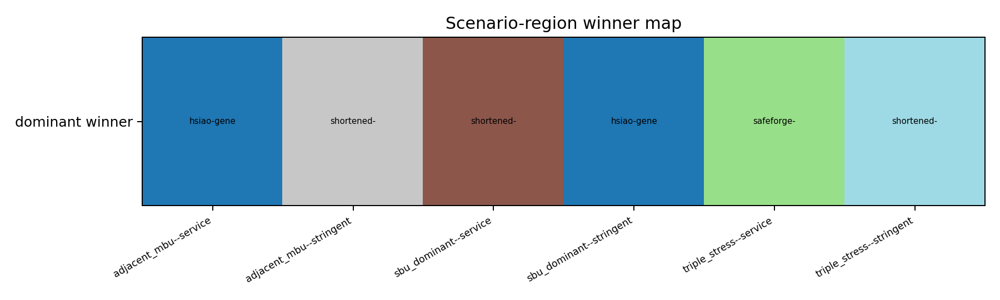
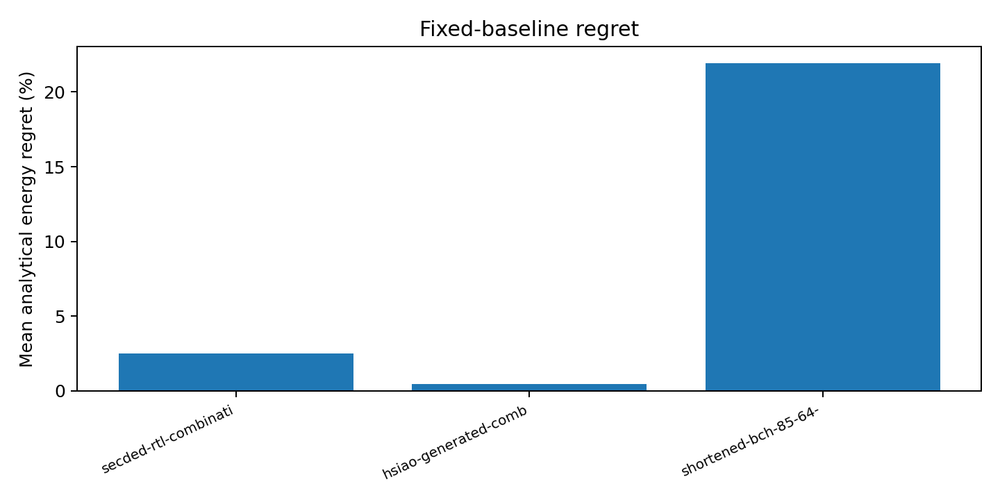
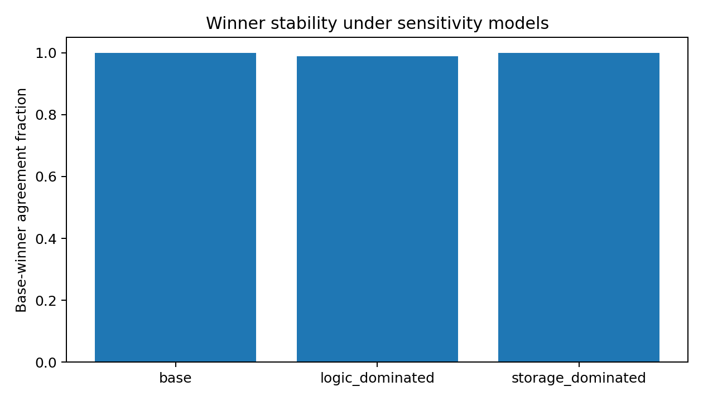

# GREEN-ECC-PHY software simulation study

## Research question

Across functionally verified ECC implementations, which implementation is preferred under different SRAM error, workload, and reliability scenarios when exact functional metrics are separated from explicitly analytical metrics? Does the preferred implementation change, and which reliability, redundancy, latency-complexity, energy, and carbon trade-offs cause the changes?

## Method

The study uses 15 distinct mathematical code specifications and 17 deployed encoder/decoder policies. Two implementations fail their guaranteed universes and are excluded from selection; 15 remain selectable. For each selectable implementation, the decoder is exhaustively executed on every single, adjacent and non-adjacent double, and adjacent and non-adjacent triple mask over a canonical codeword. Linearity plus translation-invariant syndrome policies proves data independence for these masks.

The scenario matrix is preregistered in `green_ecc_physical_simulation/registry/scenarios/software-simulation-study-v1.json`. Its 192 cases are the Cartesian product of two voltages, two temperatures, two scrub intervals, two grid-carbon intensities, three fault profiles, two workloads, and two residual reliability requirements. Fault probabilities and energy coefficients are deliberately labelled uncalibrated sensitivity parameters.

Candidates are filtered by functional verification and analytical SDC/DUE limits. The Pareto set minimizes SDC, DUE, modelled total energy, encoded bits per 64-bit payload, and decoder-complexity proxy. The preregistered selector is lexicographic: total analytical energy, decoder complexity, encoded bits, then stable implementation ID. No post-hoc weights are used.

## Fair comparison

The study normalizes per information bit, per protected 64-bit word, per 512-bit cache line, equal workload, equal reliability requirement, and equal information capacity. It charges `ceil(payload/k)` codewords. Thus BCH (63,51) uses two codewords (126 encoded bits) and 38 padding information positions for a 64-bit payload, whereas each k=64 candidate uses one codeword.

Exact metrics and analytical metrics are separate. Analytical objects carry a value, unit, model ID, parameter provenance, evidence level, and sensitivity range. Physical fields remain null throughout.

## Portfolio and exact verification

The principal exact results are:

| Implementation | Verified result | Status |
|---|---|---|
| Hsiao SECDED (72,64) | 72/72 singles corrected; 2,556/2,556 doubles detected | selectable |
| Conventional SECDED (72,64) | 72/72 singles corrected; 2,556/2,556 doubles detected | selectable |
| Bounded TAEC policy | shared SECDED universe passes; 0/62 adjacent triples corrected and 62/62 silently miscorrected | partially verified/selectable only by exact behavior |
| Bounded SEC-DAEC policy | 302/2,556 double silent miscorrections; only 10/63 adjacent pairs corrected | rejected |
| Historical cyclic/BCH-labelled (63,51) | exact d=2; 33/63 single silent miscorrections | rejected |
| Valid primitive BCH (63,51,t=2) | exact d=5; all 2,016 masks through weight two corrected | selectable |
| Shortened BCH (71,64,t=1) | exact d=3; 71/71 singles corrected | selectable |
| Shortened BCH (78,64,t=2) | exact d=5; 3,081/3,081 masks through weight two corrected | selectable |
| Shortened BCH (85,64,t=3) | designed d>=7; 102,425/102,425 masks through weight three corrected | selectable |
| Eight archived SafeForge/CodeForge policies | exact G/H distance and every archived correction-table leader verified | selectable subject to scenario SDC/DUE limits |

The full implementation-capability matrix is machine-readable at `green_ecc_physical_simulation/multi_ecc_evaluation/implementation_capability_matrix.json`.

## Scenario results

All 192 scenarios have a feasible winner. The preferred implementation changes by fault profile and reliability requirement:

| Region | Winner | Count |
|---|---|---:|
| SBU-dominant/service | shortened BCH (71,64,t=1) | 32 |
| SBU-dominant/stringent | Hsiao SECDED | 32 |
| adjacent-MBU/service | Hsiao SECDED | 32 |
| adjacent-MBU/stringent | shortened BCH (78,64,t=2) | 32 |
| triple-stress/service | SafeForge robust (72,64) abstaining policy | 32 |
| triple-stress/stringent | shortened BCH (85,64,t=3) | 32 |

The service-level triple-stress winner is an instructive trade-off: its deployed table abstains/detects on many patterns rather than silently correcting them, and the service DUE budget permits that behavior. Under stringent DUE/SDC requirements, the t=3 BCH replaces it.



## Pareto and regret

Primitive BCH (63,51,t=2) and shortened BCH (78,64,t=2) are each Pareto members in 160/192 scenarios; shortened t=3 appears in 128/192; Hsiao and the robust SafeForge policy each appear in 96/192. Pareto membership is not a physical dominance result because the cost axes are exact structural and analytical-sensitivity metrics.

Fixed-baseline analytical regret, calculated only where the baseline is feasible, is:

| Fixed baseline | Comparable scenarios | Mean energy regret | Constraint failures/missing |
|---|---:|---:|---:|
| Conventional SECDED | 96 | 2.499% | 96 |
| Hsiao SECDED | 96 | 0.459% | 96 |
| Strongest BCH t=3 | 192 | 21.937% | 0 |



## Uncertainty and sensitivity

The base and storage-dominated sensitivity models preserve 192/192 winners. The logic-dominated model preserves 190/192, or 98.96%. The two changes occur in SBU/service scenarios, where the analytical ranking of a shortened t=1 BCH and a small abstaining SafeForge policy is close. The main fault/reliability region changes are therefore robust to the tested coefficient scales, while one narrow region remains parameter-sensitive.



## Adaptive threshold

No MUX, controller, transition, or re-encoding implementation has characterized physical cost. Consequently, the study gives only the parameterized analytical condition

```text
E_mux + E_controller + N_transition*E_transition
  + N_reencoded_bits*E_reencode_per_bit < E_best_fixed - E_oracle.
```

Across comparable grid records, the modelled aggregate oracle advantage over the best single fixed coverage strategy is 0.0111846515 J. Adaptation remains analytically beneficial only while total hypothetical overhead is below that modelled advantage. This is not a measured break-even and must not be used as a hardware budget.

## Supported conclusion

The preregistered decision rule is satisfied: multiple verified implementations win materially different scenario regions, and fixed baselines have non-zero regret. The strongest supported research conclusion is therefore:

> Scenario-aware ECC selection is supported within the declared exact-functional and analytical-sensitivity model. Reliability constraints drive transitions from lower-redundancy or abstaining policies to Hsiao, t=2 BCH, and t=3 BCH as MBU strength and required residual reliability increase.

The physical-scientific-result gate remains failed. No claim is made about physical energy saving, physical architecture break-even, layout/timing, technology independence, silicon validation, or a measured winner.

## Reproduction

```text
python scripts/build_multi_ecc_catalogue.py
python scripts/run_multi_ecc_framework_evaluation.py
make
make test
python -m pytest -q
```

Traceable records are in `scenario_selection_results.json`, `pareto_and_regret.json`, `uncertainty_and_sensitivity.json`, `scenario_regions.json`, and `plot_manifest.json` under `green_ecc_physical_simulation/multi_ecc_evaluation`.
