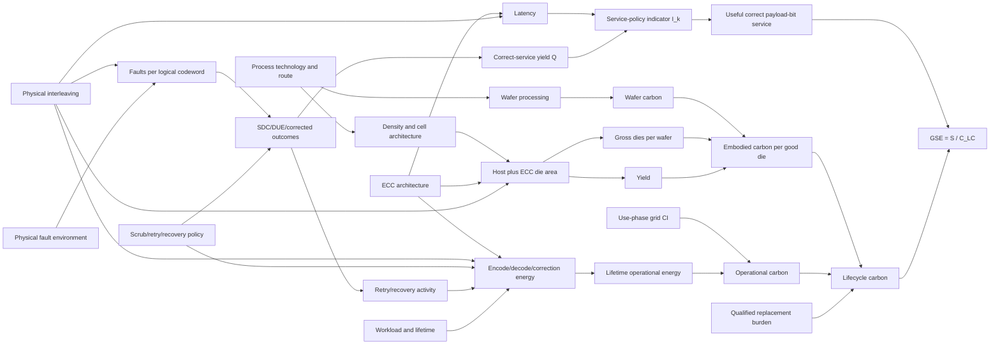

# Metric causal graph

Latency enters useful service only when an externally declared SLA exists. Otherwise latency remains a separate Pareto dimension. Recovery energy is part of operational energy exactly once; only distinct replacement/maintenance burdens use a separate lifecycle term.
