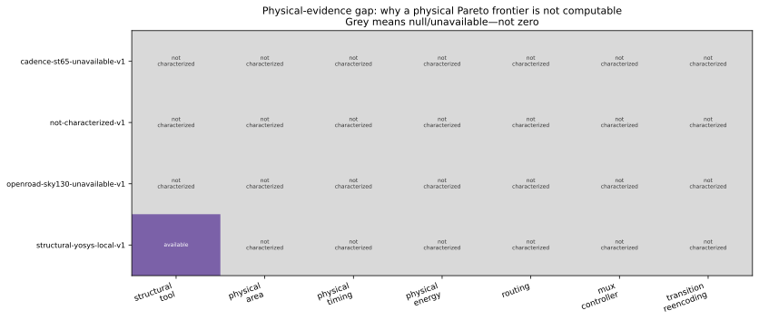

# Characterization and evidence

Characterization attaches implementation, architecture, workload, backend, tool and technology context to metrics. The storage schema is intentionally null-safe: a missing physical quantity remains `null`, never `0` and never a proxy with a physical label.

## Eligibility and command

A pair is characterizable only when the implementation passes functional verification and the architecture manifest allows it.

```text
python eccsim.py characterize --implementation hsiao-generated-combinational-72-64-v1 --architecture fixed-hsiao-whole-memory-v1 --backend green_ecc_physical_simulation/registry/backends/structural-yosys-local-v1.json --workload green_ecc_physical_simulation/registry/workloads/functional-uniform-placeholder-v1.json --outdir tmp/characterization
```

This command is a verified interface. With the local structural Yosys backend it yields `evidence_level: structural_only`, generic structural provenance, and null physical fields. An unavailable backend emits explicit reasons rather than guessed metrics.

## What a physical record would require

| Context | Required binding |
|---|---|
| Implementation | Manifest/source/matrix hash and passing verification hash |
| Architecture | Allowed implementation, active/fallback identity, metadata/MUX/controller ownership |
| Workload | Activity, read/write/correction behavior and hash |
| Backend | Tool flow and version |
| Technology | PDK, standard-cell/memory libraries, corners |
| Constraints | Clock, I/O, load, operating voltage and temperature |
| Metrics | Units and extraction provenance for area, timing, power/energy and routing |
| Uncertainty | Repeats, variation sources or explicit interval model |

Generic Yosys cells do not have a portable square-micrometre area, characterized delay, switching power, leakage or routed wire cost. Operation counts and the study's logic-depth proxy are useful structural diagnostics only.


*Evidence classes: blue exact/analytical availability; grey means “not characterized,” not zero. Data: [`figure_data/evidence_availability_matrix.json`](figure_data/evidence_availability_matrix.json).*


*Purple structural proxies are technology-independent counts derived from matrices and decoder tables. They are not physical PPA or measured delay. Data: [`figure_data/structural_complexity_structural_only.json`](figure_data/structural_complexity_structural_only.json).*

## Current backends

- `structural-yosys-local-v1`: available generic structural evidence; physical metrics unavailable;
- `openroad-sky130-unavailable-v1`: explicit absence of OpenSTA/OpenROAD/SKY130/OpenRAM collateral;
- `cadence-st65-unavailable-v1`: explicit absence of commercial tools, ST65 PDK and libraries;
- `not-characterized-v1`: explicit null backend.

The current evaluation produces 18 implementation/architecture characterization records because some implementations support multiple deployment forms. None qualifies as a physical characterization.

## Physical selection returns no winner

Verified interface:

```text
python eccsim.py select-physical --characterization green_ecc_physical_simulation/multi_ecc_evaluation/characterization --scenario green_ecc_physical_simulation/registry/scenarios/no-physical-selection-v1.json --outdir tmp/physical-selection
```

The result has `candidate_count: 0`, `winner: null`, and reasons such as `not physical characterization` and `objective encoder_energy is unsupported`. This is the correct scientific result.



*The available purple cell is structural-only. No fake physical Pareto points are generated. Data: [`figure_data/physical_evidence_gap.json`](figure_data/physical_evidence_gap.json).*
