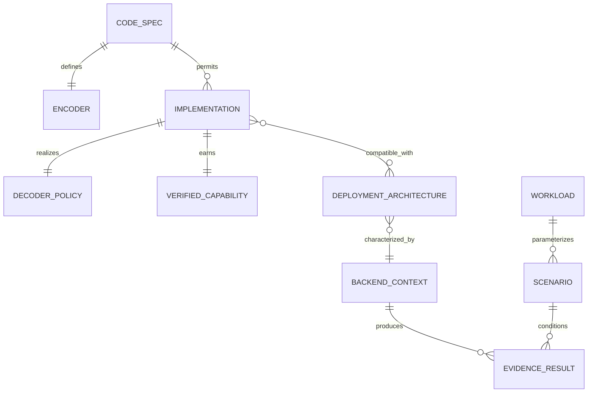

# Concepts and identities

GREEN-ECC-PHY prevents category errors by assigning a separate identifier and owner to every scientific layer.

## Entity responsibilities

| Entity/identifier | Owns | Must not imply |
|---|---|---|
| `code_spec_id` | Field, `(n,k)`, codeword set, matrices/polynomial, shortening/puncturing, distance evidence | A particular decoder's behavior or PPA |
| `encoder_id` | Mapping from `k` information bits to one valid `n`-bit codeword | That another encoder with a similar label is equivalent |
| `implementation_id` | Concrete adapter/RTL/reference, protocol, latency, metadata and architecture compatibility | A guarantee not passed by verification |
| `decoder_policy_id` | Syndrome/observation-to-action rule, including correction, detection and abstention | A new codeword set |
| verified capability/class ID | Tested correction/detection universe and acceptable statuses | Behavior outside that universe |
| `architecture_id` | Fixed/configurable/adaptive placement, active/fallback implementations, MUX/controller/transition ownership | Measured architecture overhead |
| `backend_id` | Tool, PDK/library/corner availability and evidence level | Physical evidence when fields are null |
| `workload_id` | Access count, lifetime, read/write behavior, activity assumptions | A universal use profile |
| `scenario_id` | Voltage, temperature, scrub, carbon, fault, workload and requirement tuple | Measurements at those conditions |
| candidate/result ID | Identity chain plus exact, analytical and physical fields | Permission to merge evidence classes |

## Repository examples

Conventional SECDED, bounded SEC-DAEC, and bounded TAEC point to `extended-hamming-secded-72-64-v1`. Their systematic encoder and codeword set are shared; their decoder policies differ. Therefore three implementation records are necessary. Current evidence fully verifies conventional SECDED, rejects SEC-DAEC's claimed DED/adjacent-pair guarantees, and partially verifies TAEC only for its inherited SECDED behavior.

A genuinely distinct `(75,64)` TAEC parity-check matrix would define a different codeword set and therefore requires a new `code_spec_id`, even if its decoder marketing name is also “TAEC.” Conversely, merely changing a syndrome-action table while retaining the matrix creates a new implementation/policy, not a new mathematical code.

Hsiao and positional extended-Hamming codes share dimensions and SECDED-level distance, but the repository does not contain a proved coordinate equivalence between their matrices. They remain distinct code specifications. Dimensions or family names are not an equivalence certificate.

`repository-cyclic-63-51-v1` remains catalogued because negative evidence is scientifically valuable. Its implementation corrects only 30/63 single-bit masks and miscorrects 33/63; its exact minimum distance is two. It is rejected and never silently promoted to the valid primitive BCH `(63,51,t=2)` identity.

The repetition-code fixture under `tests/fixtures/multi_ecc_external/` demonstrates that `module:callable` and `file.py::callable` factories can extend the registry without family-specific core edits. Because it is test-only and absent from the built-in registry, it is excluded from scientific catalogue counts.

*Evidence: `exact_functional`. The corresponding plot data and source hashes are in [`figure_data/code_rate_redundancy.json`](figure_data/code_rate_redundancy.json).*
