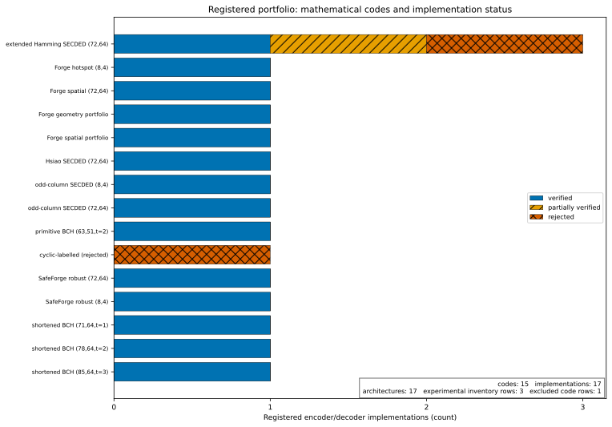

# ECC catalogue

This catalogue distinguishes mathematical code specifications from concrete encoder/decoder implementations. Tables are regenerated from the registry and verification matrix; do not hand-edit the marked section.

<!-- BEGIN GENERATED:CATALOGUE_TABLES -->
### Mathematical codes

| `code_spec_id` | Family | `(n,k)` | Redundancy | Rate | Implementations |
|---|---|---:|---:|---:|---:|
| `extended-hamming-secded-72-64-v1` | Extended Hamming SECDED | (72,64) | 8 | 0.888889 | 3 |
| `forge-hotspot-8-4-v1` | SafeForge/CodeForge synthesized binary linear code | (8,4) | 4 | 0.500000 | 1 |
| `forge-spatial-hotspot-72-64-v1` | SafeForge/CodeForge synthesized binary linear code | (72,64) | 8 | 0.888889 | 1 |
| `forge-sram-portfolio-72-64-v1-geometry-filtered-joint` | SafeForge/CodeForge synthesized binary linear code | (72,64) | 8 | 0.888889 | 1 |
| `forge-sram-portfolio-72-64-v1-spatial-hotspot-joint` | SafeForge/CodeForge synthesized binary linear code | (72,64) | 8 | 0.888889 | 1 |
| `hsiao-secded-72-64-v1` | Hsiao SECDED | (72,64) | 8 | 0.888889 | 1 |
| `odd-column-secded-4-8` | SafeForge/CodeForge synthesized binary linear code | (8,4) | 4 | 0.500000 | 1 |
| `odd-column-secded-64-72` | SafeForge/CodeForge synthesized binary linear code | (72,64) | 8 | 0.888889 | 1 |
| `primitive-bch-63-51-t2-v1` | Primitive binary BCH | (63,51) | 12 | 0.809524 | 1 |
| `repository-cyclic-63-51-v1` | BCH candidate / cyclic code | (63,51) | 12 | 0.809524 | 1 |
| `safeforge-robust-72-64-mapping-v1` | SafeForge/CodeForge synthesized binary linear code | (72,64) | 8 | 0.888889 | 1 |
| `safeforge-robust-8-4-v1` | SafeForge/CodeForge synthesized binary linear code | (8,4) | 4 | 0.500000 | 1 |
| `shortened-bch-71-64-t1-v1` | Primitive binary BCH | (71,64) | 7 | 0.901408 | 1 |
| `shortened-bch-78-64-t2-v1` | Primitive binary BCH | (78,64) | 14 | 0.820513 | 1 |
| `shortened-bch-85-64-t3-v1` | Primitive binary BCH | (85,64) | 21 | 0.752941 | 1 |

### Encoder/decoder implementations

| `implementation_id` | `code_spec_id` | `decoder_policy_id` | Verification state | Architectures |
|---|---|---|---|---:|
| `cyclic-rtl-bounded-search-63-51-v1` | `repository-cyclic-63-51-v1` | `bounded-valid-codeword-search-weight2-v1` | `rejected` | 1 |
| `forge-hotspot-8-4-v1-archived-table-decoder` | `forge-hotspot-8-4-v1` | `forge-hotspot-8-4-v1-archived-syndrome-table` | `fully_verified` | 1 |
| `forge-spatial-hotspot-72-64-v1-archived-table-decoder` | `forge-spatial-hotspot-72-64-v1` | `forge-spatial-hotspot-72-64-v1-archived-syndrome-table` | `fully_verified` | 1 |
| `forge-sram-portfolio-72-64-v1-geometry-filtered-joint-archived-table-decoder` | `forge-sram-portfolio-72-64-v1-geometry-filtered-joint` | `forge-sram-portfolio-72-64-v1-geometry-filtered-joint-archived-syndrome-table` | `fully_verified` | 1 |
| `forge-sram-portfolio-72-64-v1-spatial-hotspot-joint-archived-table-decoder` | `forge-sram-portfolio-72-64-v1-spatial-hotspot-joint` | `forge-sram-portfolio-72-64-v1-spatial-hotspot-joint-archived-syndrome-table` | `fully_verified` | 1 |
| `hsiao-generated-combinational-72-64-v1` | `hsiao-secded-72-64-v1` | `minimum-weight-single-syndrome-v1` | `fully_verified` | 1 |
| `odd-column-secded-4-8-archived-table-decoder` | `odd-column-secded-4-8` | `odd-column-secded-4-8-archived-syndrome-table` | `fully_verified` | 1 |
| `odd-column-secded-64-72-archived-table-decoder` | `odd-column-secded-64-72` | `odd-column-secded-64-72-archived-syndrome-table` | `fully_verified` | 1 |
| `primitive-bch-63-51-t2-v1-reference-decoder` | `primitive-bch-63-51-t2-v1` | `primitive-bch-bounded-syndrome-t2-v1` | `fully_verified` | 1 |
| `safeforge-robust-72-64-mapping-v1-archived-table-decoder` | `safeforge-robust-72-64-mapping-v1` | `safeforge-robust-72-64-mapping-v1-archived-syndrome-table` | `fully_verified` | 1 |
| `safeforge-robust-8-4-v1-archived-table-decoder` | `safeforge-robust-8-4-v1` | `safeforge-robust-8-4-v1-archived-syndrome-table` | `fully_verified` | 1 |
| `secdaec-rtl-bounded-72-64-v1` | `extended-hamming-secded-72-64-v1` | `repository-bounded-adjacent-double-v1` | `rejected` | 2 |
| `secded-rtl-combinational-72-64-v1` | `extended-hamming-secded-72-64-v1` | `repository-secded-v1` | `fully_verified` | 3 |
| `shortened-bch-71-64-t1-v1-reference-decoder` | `shortened-bch-71-64-t1-v1` | `primitive-bch-bounded-syndrome-t1-v1` | `fully_verified` | 1 |
| `shortened-bch-78-64-t2-v1-reference-decoder` | `shortened-bch-78-64-t2-v1` | `primitive-bch-bounded-syndrome-t2-v1` | `fully_verified` | 1 |
| `shortened-bch-85-64-t3-v1-reference-decoder` | `shortened-bch-85-64-t3-v1` | `primitive-bch-bounded-syndrome-t3-v1` | `fully_verified` | 1 |
| `taec-rtl-bounded-72-64-v1` | `extended-hamming-secded-72-64-v1` | `repository-bounded-adjacent-triple-v1` | `partially_verified` | 2 |

### Registry totals

The current registry contains **15 codes**, **17 implementations**, **17 architectures**, and **4 backend manifests**. These totals exclude the test-only external repetition-code fixture.
<!-- END GENERATED:CATALOGUE_TABLES -->

## Status interpretation

- `fully_verified`: every guaranteed and implementation-specific claimed universe passed, with required evidence present and hash-bound.
- `partially_verified`: the implementation passes the core gate but an additional implementation claim fails; only passing capabilities are selectable.
- `rejected`: at least one guaranteed correction/detection class or mandatory evidence check fails; the record remains visible but is excluded from selection.
- experimental/excluded inventory entries: source artifacts discovered by the catalogue audit that lack the identity or evidence required for scientific selection.

*Evidence: exact registry and functional verification, with unsupported/experimental rows retained. Data: [`figure_data/registered_portfolio_overview.json`](figure_data/registered_portfolio_overview.json).*

## Important non-equivalences

The valid `primitive-bch-63-51-t2-v1` and the rejected `repository-cyclic-63-51-v1` have the same dimensions but different generator constructions, distances, and functional results. The latter is not silently relabelled or replaced. Hsiao `(72,64)` and positional extended-Hamming `(72,64)` are likewise distinct unless a coordinate-equivalence proof is supplied.

The test-only repetition code under `tests/fixtures/multi_ecc_external/` validates extensibility but is absent from these generated counts. See [Concepts and Identities](CONCEPTS_AND_IDENTITIES.md) and [Extending with a New ECC](EXTENDING_WITH_A_NEW_ECC.md).
