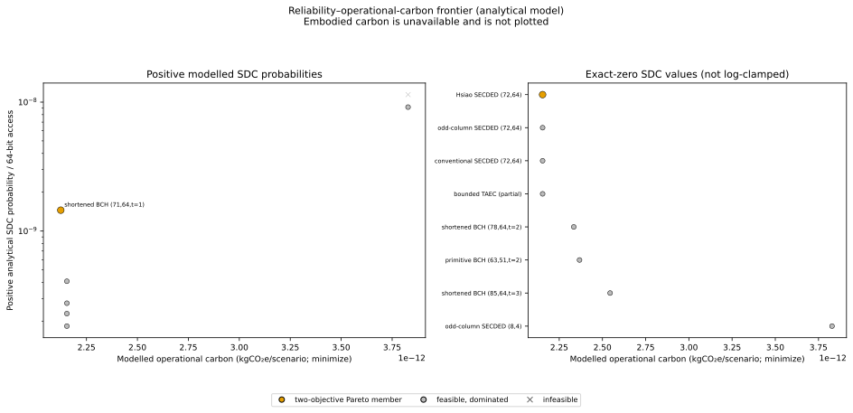
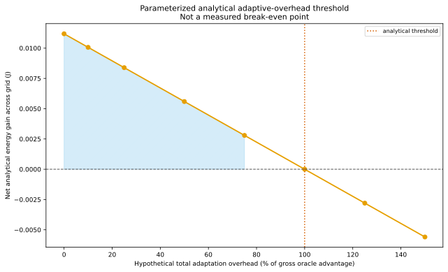

# Energy and carbon models

Energy and carbon outputs must carry their model identity and units. The current multi-ECC selection uses an explicit sensitivity model; it does not use physical power analysis.

## Multi-ECC dynamic energy

For a normalized 64-bit payload,

\[
E_{dyn,payload}=N_{encbits}E_{bit}(V)+mN_{ops}E_{xor}(V),
\qquad E_x(V)=E_x(1V)V^2.
\]

`N_encbits` is encoded bits/64-bit payload, `m=ceil(64/k)` codewords/payload, and `Nops` combines exact syndrome operations, the workload write fraction times encoder operations, and expected decoder-table activity. Energies are J/payload and J/scenario after multiplication by `payload_accesses`. Source: `green_ecc_phy/study.py::_candidate_metrics`; evidence: `analytical_model`; applicable only to the preregistered parameter set and its sensitivity scales.

For a `(72,64)` code, `N_encbits=72` and `m=1`. Actual bit and XOR energies are read from `software-simulation-study-v1.json`, never inferred from generic cell count.

The legacy `energy_model.py` instead uses a calibrated primitive table:

\[
E_{op}=N_{xor}E_{xor}(node,V)+N_{and}E_{and}(node,V)+N_{add}E_{add}(node,V),
\quad E_{dyn}=N_{access}E_{op}.
\]

Units are J/operation and J. Piecewise-linear interpolation is supported within the calibration table; out-of-range voltage is clamped with a warning. This family-level model is backward-compatible but not identity-equivalent to the multi-ECC study.

## Leakage energy

The multi-ECC study computes stored encoded bits at equal information capacity, applies a configured temperature multiplier to power/bit, then

\[
E_{leak}=N_{storedbits}P_{leak,bit}(T)t_{life}.
\]

Units are W/bit, seconds, and J/scenario. The legacy model uses `E_leak=V I_density(node,T,corner) A_overhead t`; its family area constants are analytical surrogates, not current physical characterization.

## Scrub energy

The multi-ECC study uses

\[
E_{scrub}=N_{storedbits}\frac{t_{life}}{\tau_{scrub}}E_{bit}(V)M_{rw}.
\]

`τscrub` is seconds/pass and `Mrw` a dimensionless read/write multiplier. Output is J/scenario. The legacy `scrub_energy_kwh` similarly multiplies per-read energy by memory words and scrub passes, then divides by 3.6×10⁶ J/kWh.

## Operational and embodied carbon

For the current scenario study,

\[
C_{op}=\frac{E_{total}}{3.6\times10^6}\,CI,
\]

where `Etotal` is J/scenario, `CI` is kgCO₂e/kWh, and output is kgCO₂e/scenario. Source: `green_ecc_phy/study.py::_candidate_metrics`; evidence: analytical. Example: the representative figure data records each candidate's exact source scenario and computed operational carbon in [`figure_data/reliability_carbon_pareto_analytical.json`](figure_data/reliability_carbon_pareto_analytical.json).

Embodied carbon, when physical areas and conversion factors exist, is implemented by `carbon.py`:

\[
C_{emb}=A_{logic}\alpha_{logic}+A_{macro}\alpha_{macro}.
\]

Areas are mm², factors kgCO₂e/mm², and output kgCO₂e. No implementation-specific physical area is available in the current multi-ECC study; embodied carbon is therefore unavailable and omitted from its Pareto plot.

*Orange indicates analytical/modelled data. Embodied carbon is explicitly null. Data: [`figure_data/reliability_carbon_pareto_analytical.json`](figure_data/reliability_carbon_pareto_analytical.json).*

## ESII, GS and NESII

The Environmental Sustainability Improvement Index (ESII) in `esii.py` is a bounded utility:

\[
ESII=U_{rel}\frac{w_EU_E+w_CU_C}{w_E+w_C},
\]

where reliability utility is a saturating function of non-negative FIT-decade reduction, and energy/carbon utilities are `1/(1+cost/halfsat)`. All utilities and ESII are dimensionless in `[0,1]`. Assumptions include fixed half-saturation constants and comparable reliability basis (`per_gib` or `system`).

The Green Score (GS) in `gs.py` is 100 times a weighted geometric mean of active bounded utilities for reliability, carbon, latency and overhead. Missing carbon is neutral and its weight is removed. GS is `[0,100]`; a proxy latency input remains a proxy.

Normalized ESII (NESII) in `esii.normalise_esii` winsorizes an explicit reference distribution at its 5th/95th percentiles and maps it to `[0,100]`. NESII is cohort-dependent and meaningless without the reference set. The current multi-ECC winner rule does not use ESII, GS or NESII; they remain documented legacy analytical interfaces.

## Adaptive overhead threshold

For scenario-wise oracle energy `Eoracle` and the best fixed feasible candidate `Efixed`, adaptation is analytically beneficial only if

\[
E_{mux}+E_{controller}+N_{trans}E_{trans}+N_{reencbits}E_{reenc/bit}
< \sum_s(E_{fixed,s}-E_{oracle,s}).
\]

The right-hand side is generated from the current grid. The left-hand physical components are null, so the result is a **parameterized analytical threshold**, not an actual break-even point.

*The zero crossing is a hypothetical sweep. Data: [`figure_data/adaptive_overhead_threshold.json`](figure_data/adaptive_overhead_threshold.json).*

## Notation

| Symbol | Definition | Unit | Evidence |
|---|---|---|---|
| `Ebit`, `Exor` | Per-bit/per-operation energy parameter | J/access or J/op | analytical input |
| `Edyn`, `Eleak`, `Escrub` | Dynamic, leakage and scrub energy | J/scenario | analytical |
| `CI` | Grid carbon intensity | kgCO₂e/kWh | scenario input |
| `Cop`, `Cemb` | Operational and embodied carbon | kgCO₂e | analytical; embodied unavailable in current study |
| ESII | Bounded reliability/burden utility | dimensionless `[0,1]` | analytical |
| GS, NESII | Composite/normalized scores | dimensionless `[0,100]` | analytical/cohort-dependent |
