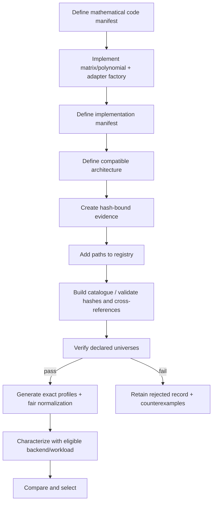

# Extending with a new ECC

The extension contract is manifest- and callable-driven. Core dispatch is by IDs, not by ECC family names. A small test-only repetition code proves that an external plugin can be loaded without family-specific changes to `green_ecc_phy`.



## 1. Code manifest

Create a versioned JSON file conforming to `schemas/ecc-code-manifest.schema.json`. It must define `code_id`/`code_spec_id`, `(n,k)`, redundancy, GF(2) field, systematic positions, encoder identity, distance evidence, correction/detection universes, known miscorrection domain, matrix definition, source provenance and hashes.

Minimal illustrative matrix definition (the enclosing manifest still needs every schema-required field):

```json
{
  "matrix_definition": {
    "deterministic_generator": {
      "callable": "my_ecc_plugin:build_matrix",
      "parameters": {"k": 4}
    }
  }
}
```

The callable returns an object containing `G` and `H`; the registry checks shape/rank and `G H^T = 0`, then compares the canonical matrix hash.

## 2. Adapter and `DecodeResult`

The adapter exposes integer widths `k` and `n`, `encode(data: int) -> int`, and `decode(codeword: int) -> DecodeResult`. Use statuses honestly:

```python
from green_ecc_phy.contracts import DecodeResult, DecodeStatus

class ExampleAdapter:
    k = 1
    n = 3

    def encode(self, data: int) -> int:
        if data not in (0, 1):
            raise ValueError("example data must be one bit")
        return 0b111 if data else 0

    def decode(self, codeword: int) -> DecodeResult:
        if codeword < 0 or codeword >= 8:
            return DecodeResult(None, DecodeStatus.INVALID_CONFIGURATION,
                                None, None, None, 0)
        ones = codeword.bit_count()
        data = int(ones >= 2)
        corrected = 0b111 if data else 0
        status = DecodeStatus.NO_ERROR if codeword in (0, 0b111) else DecodeStatus.CORRECTED
        return DecodeResult(data, status, None, corrected, None, 0)

def create_adapter(*, code, implementation):
    del code, implementation
    return ExampleAdapter()
```

The harness derives silent miscorrection by comparing `result.data` with golden data. Do not report `CORRECTED` as proof that data is correct.

## 3. Factory syntax

- `module:callable` imports an importable Python module, for example `my_ecc_plugin:create_adapter`.
- `file.py::callable` loads a file. A relative path resolves from the manifest directory, for example `../plugin.py::create_adapter`.

Exact loader errors include:

- `callable must use module:attribute or file.py::attribute: ...`;
- `relative plugin path requires a base directory: ...`;
- `plugin file does not exist: ...`;
- `plugin attribute is not callable: ...`.

## 4. Implementation manifest

Create a file conforming to `schemas/ecc-implementation-manifest.schema.json`. It binds:

- `implementation_id`, `code_id`/`code_spec_id`, `encoder_id`, `decoder_policy_id`;
- adapter factory and parameters;
- architecture style, protocol, latency/initiation interval and clock/reset;
- wrapper/top names where RTL exists;
- metadata, MUX/controller, transition and re-encoding ownership;
- declared correction/detection claims and data-independence proof;
- source files and SHA-256 values;
- hash-bound verification evidence;
- compatible architecture IDs.

Matrices/polynomials belong to the code specification; decoder choices belong to the implementation. If the codeword set changes, add a code manifest. If only the syndrome policy changes, add another implementation under the same code.

## 5. Declared universes and evidence

Declare only finite, executable correction/detection universes. For a linear translation-invariant decoder, state the proof explicitly. Provide an evidence JSON or report with a stable test ID and source hash. RTL protocol/reset tests are required when stateful; combinational adapters may mark them not applicable.

Never copy a family-level `t` value without linking it to the actual polynomial/matrix and exhaustive or independent proof. The rejected repository cyclic entry shows why.

## 6. Deployment architecture

Create a manifest conforming to `schemas/deployment-architecture.schema.json`. A fixed example has one allowed/active implementation, static configuration, no fallback, no MUX/controller and no transition. Configurable/adaptive forms must own and eventually characterize MUX/controller, transition, metadata and re-encoding costs.

## 7. Registry and hashes

Add relative paths to a registry JSON with arrays `codes`, `implementations`, `architectures`, and `backends`. Regenerate manifest, matrix and source hashes using repository helpers/builders rather than typing them manually. Typical exact failures are:

- `duplicate code_id: ...` or `duplicate implementation_id: ...`;
- `broken manifest_sha256`;
- `broken matrix_sha256`;
- `broken source hash for ...`;
- `matrix generator must return G and H`;
- `G H^T != 0`;
- `implementation ... references unknown code_id ...`;
- `architecture ... references unknown implementations: ...`.

## 8. Regenerate and verify

For a private external registry:

```text
python eccsim.py ecc list --registry path/to/registry.json
python eccsim.py ecc inspect --registry path/to/registry.json --code your-code-id
python eccsim.py ecc verify --registry path/to/registry.json --implementation your-implementation-id --out tmp/verification.json
```

For integration into the built-in catalogue:

```text
python scripts/build_multi_ecc_catalogue.py
python scripts/run_multi_ecc_framework_evaluation.py
```

A new passing implementation receives exact profiles, payload normalization and structural proxies. A rejected one remains in catalogue/audit plots and is excluded from scenario selection.

## 9. Characterize, compare and select

Use `characterize` with one compatible architecture, backend manifest and workload. Structural-only output is useful but physical fields remain null. Only a complete physical backend context can feed `select-physical`; otherwise expect `winner: null`.

## 10. Required regression tests

- deterministic encoder and no-error round trip;
- invalid width/input behavior;
- exhaustive declared correction/detection universes;
- golden-data miscorrection detection and stable counterexample;
- source/matrix/manifest hash rejection;
- protocol, latency, reset and transition behavior as applicable;
- external-registry load through both factory syntaxes used;
- architecture cross-reference and incompatibility rejection;
- catalogue counts excluding test-only fixture;
- deterministic train→predict and OOD fallback if advisory ML is extended;
- full `make`, `make test`, and `python -m pytest -q`.

The working fixture is `tests/fixtures/multi_ecc_external/`; its acceptance test is in `tests/python/test_multi_ecc_framework.py`.
