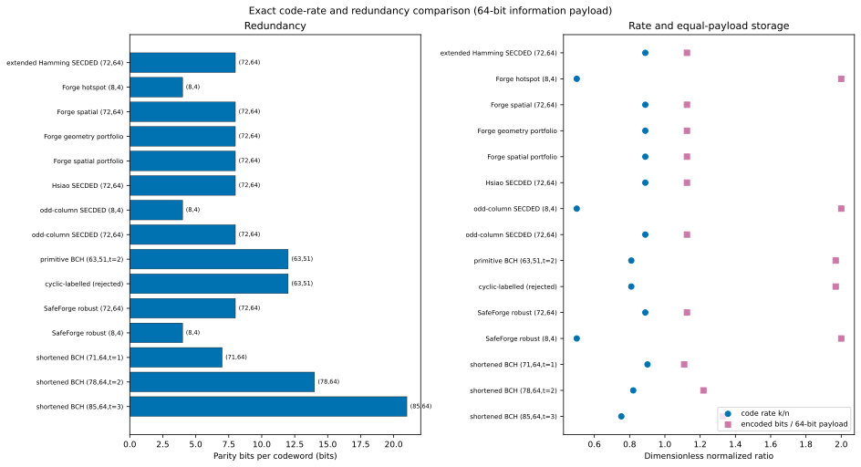
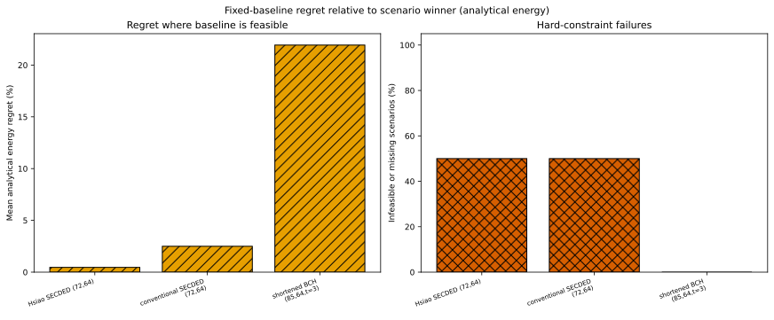

# Fair comparison

An ECC comparison is meaningful only after choosing what is held equal. GREEN-ECC-PHY keeps multiple fairness views explicit and never merges candidates merely because they have similar names.

## Comparison views

| View | Rule | Typical question |
|---|---|---|
| Equal data width | Identical `k` | Which implementation protects the same information word? |
| Equal codeword width | Identical `n` | Which code fits a fixed transfer/storage word? |
| Equal redundancy | Identical `n-k` | What changes at the same parity budget? |
| Equal information capacity | Scale stored codewords to identical useful bits | What storage/leakage/scrub burden protects the same payload? |
| Equal guaranteed reliability | Identical verified correction/detection domain hash | How do implementations with the same proven capability compare? |
| Same code/different implementation | Hold `code_spec_id` fixed | What does decoder policy change? |
| Same code/across architectures | Hold code fixed, vary `architecture_id` | What does placement/deployment change? |
| Same implementation/across corners | Hold implementation fixed, vary backend/corner | How sensitive is physical evidence? |
| Equal workload | Identical workload hash | Are energy/activity totals commensurate? |
| Equal timing target/area budget | Identical constraints or explicit budget | Are physical objectives comparable? |

The generated `comparison_views.json` records these groups. A group with one candidate is valid provenance but cannot establish a relative winner.

## Equal-payload normalization

For information payload `B`, a `(n,k)` code uses

\[
N_{cw}=\lceil B/k\rceil,\quad B_{enc}=nN_{cw},\quad B_{pad}=kN_{cw}-B.
\]

All three quantities are bits and exact. The current study provides 1-, 64-, and 512-bit views; selection uses the 64-bit view and scales storage to equal useful capacity. A `(63,51)` code therefore uses two codewords for a 64-bit payload and must not be compared as though it stored only 63 bits.

*The square marker is encoded bits per 64-bit information payload, which makes fragmentation explicit. Data: [`figure_data/code_rate_redundancy.json`](figure_data/code_rate_redundancy.json).*

## Filtering order

1. use a registered identity chain;
2. require passing functional verification/capability;
3. choose a fairness view and compatible workload/architecture/backend context;
4. apply hard scenario SDC and DUE limits;
5. reject null/non-finite required objectives;
6. compute Pareto dominance;
7. apply the documented deterministic winner rule.

Reversing the order is unsafe: normalizing a rejected decoder or replacing a null physical objective with zero can create a false winner.

## Fixed-baseline regret

For feasible baseline `b` and selected scenario winner `w_s`, analytical energy regret is

\[
R_s(b)=E_s(b)-E_s(w_s),\qquad r_s(b)=R_s(b)/E_s(b).
\]

Units are J/scenario for `R`; `r` is dimensionless. Baseline-infeasible scenarios are not assigned an infinite or fabricated numeric regret; they are counted separately.

*The left panel summarizes comparable feasible scenarios; the right reports hard-constraint failures. Data: [`figure_data/fixed_baseline_regret.json`](figure_data/fixed_baseline_regret.json).*
