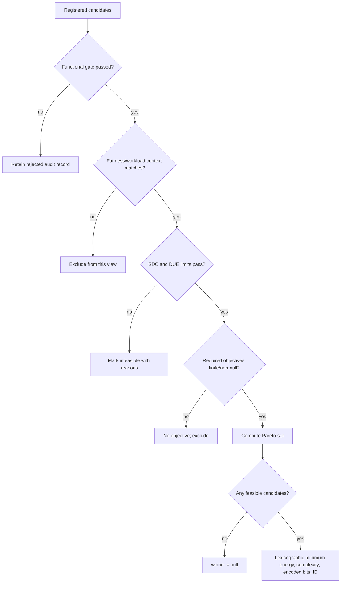
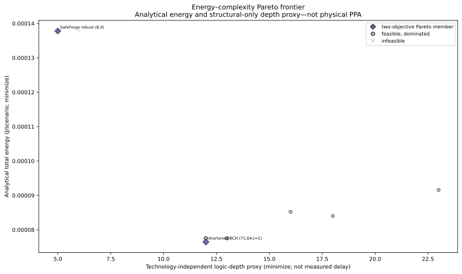
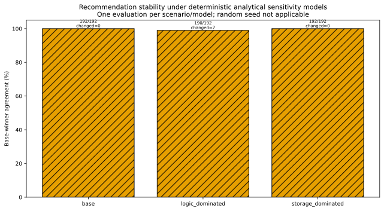

# Pareto and selection

The current multi-ECC study uses Pareto analysis for audit and a deterministic lexicographic winner rule for selection. They answer different questions: Pareto membership asks whether any feasible candidate is no worse in every objective; the winner rule chooses one minimum-energy feasible record.

## Eligibility before dominance

Candidates enter the analytical frontier only after:

1. implementation verification passes;
2. exact outcome fractions exist for the fault-profile classes;
3. SDC probability is at or below the scenario limit;
4. DUE probability is at or below the scenario limit;
5. every required objective is finite and non-null;
6. the comparison uses the same 64-bit payload, information capacity, workload and scenario.

Rejected and infeasible candidates remain in `candidate_decisions` and audit plots. Null is never converted to zero.



## Objective definitions and directions

The five-dimensional scenario frontier minimizes:

1. analytical SDC probability per 64-bit access;
2. analytical DUE probability per 64-bit access;
3. modelled total energy in J/scenario;
4. encoded bits per 64-bit information payload;
5. decoder complexity proxy.

Every direction is `min`; epsilon is `0.0`. The winner rule then minimizes `(modelled_total_energy, decoder_complexity_proxy, encoded_bits, implementation_id)` among feasible candidates. It is not a weighted score and does not select the plotted knee.

## Dominance and epsilon dominance

For objectives transformed so lower is better, candidate `a` dominates `b` when

\[
\forall j:\ f_j(a)\le f_j(b),\qquad \exists j:\ f_j(a)<f_j(b).
\]

With per-objective epsilon `εj`, the independent validator treats `a` as no worse when `f_j(a) ≤ f_j(b)+εj` and strictly better when at least one `f_j(a)<f_j(b)-εj`. Maximization objectives reverse those inequalities. The current study uses zero epsilon; the implementation supports mixed directions in its tests.

Identity-distinct duplicate points are both retained because neither is strictly better. A deterministic `implementation_id` tie break applies only when choosing one winner, not when deleting a duplicate from the frontier.

## Crowding distance

For each objective, front points are sorted, boundary points receive infinite crowding distance, and each interior point receives the normalized neighbor span

\[
d_i\mathrel{+}=\frac{f_{i+1}-f_{i-1}}{f_{max}-f_{min}}.
\]

Crowding distance is dimensionless and is an audit/diversity statistic; it does not alter the current selector.

## Knee point

For a two-objective plot, the documentation pipeline orients both objectives to minimization, normalizes each to `[0,1]`, finds the extreme endpoints, and selects the point with maximum perpendicular distance from their chord. Ties use identifier order. A one-point frontier returns that point; an empty frontier has no knee. This geometric knee is annotated separately from the selector winner.

## Hypervolume

The 2D documentation audit computes exact dominated area against a data-derived reference point 5% worse than the maximum plotted Pareto objective in each dimension. Units are the product of the plotted units and the reference is stored in figure data. Duplicates are de-duplicated geometrically. Hypervolume is not used to choose a winner.

## Independent validation

`green_ecc_phy/pareto_validation.py` does not import the study selector's private `_pareto` or `_dominates`. `scripts/generate_documentation_figures.py` independently recomputes all 192 five-objective frontiers after constraints and requires exact identifier agreement with `scenario_selection_results.json`; any mismatch stops figure generation.

Targeted tests cover dominated/equal points, mixed directions, nulls, rejected/infeasible candidates, one/zero-candidate fronts, epsilon boundaries, crowding, knee and hypervolume:

```text
python -m pytest -q tests/python/test_documentation_pareto.py
```


*Orange marks the independently reproduced five-objective frontier; grey mutes dominated candidates, crosses are infeasible, and rings distinguish winner and projected knee. Data includes objectives, epsilon, constraint order, hypervolume reference and scenario hash: [`figure_data/reliability_cost_pareto_analytical.json`](figure_data/reliability_cost_pareto_analytical.json).*



*Logic depth is a structural proxy—not measured latency. Data: [`figure_data/energy_complexity_pareto_analytical.json`](figure_data/energy_complexity_pareto_analytical.json).*

## Uncertainty treatment

The selector is rerun once for each deterministic uncertainty scale tuple. Stability is the fraction of scenarios whose winner equals the base winner. No probability distribution is fitted, no random sample is drawn, and the seed is therefore `null`/not applicable. Changed scenarios indicate sensitivity, not statistical significance.



*Counts and explicit deterministic-sample semantics: [`figure_data/recommendation_stability.json`](figure_data/recommendation_stability.json).*

## Physical frontier

A physical Pareto frontier is **not computable** because all required physical objectives are null and every generated characterization is structural-only or unavailable. `select-physical` correctly returns `winner: null`. No empty axes or proxy-to-physical substitution is presented as a frontier.
