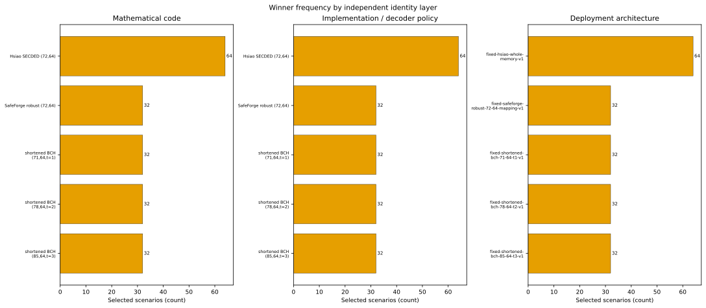
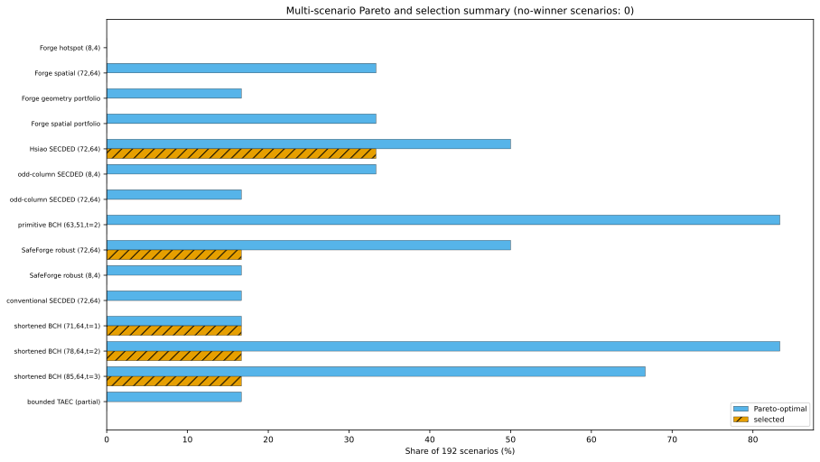
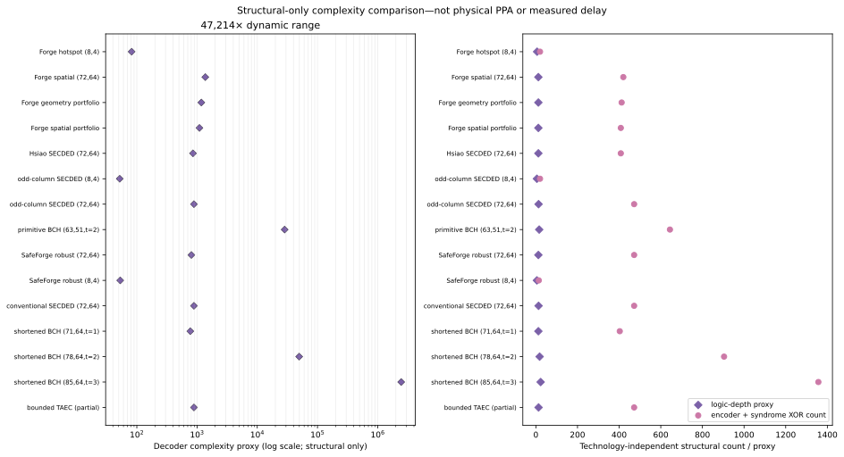
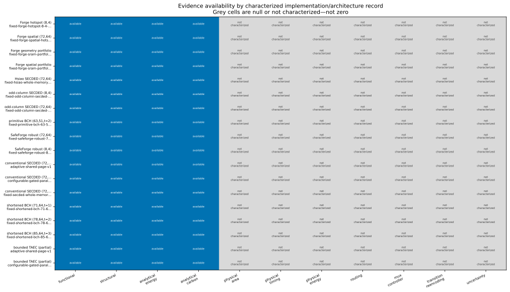

# Results and interpretation

This page leads with the current regenerated artifacts. Historical energy/carbon percentages are not repeated unless the present pipeline reproduces them.

<!-- BEGIN GENERATED:CURRENT_RESULTS -->
### Regenerated study summary

| Quantity | Current value | Evidence |
|---|---:|---|
| Registered mathematical codes | 15 | exact registry |
| Registered implementations | 17 | exact registry |
| Registered architectures | 17 | exact registry |
| Selectable implementations | 15 | exact verification gate |
| Verified capability claims | 31 | exact functional |
| Rejected implementations | 2 | exact functional |
| Scenarios | 192 | preregistered analytical grid |
| Feasible/no-winner scenarios | 192 / 0 | exact constraint evaluation over analytical metrics |
| Physical objective coverage | 0 | unsupported/null |

### Exact negative results

| Rejected implementation | Exact reason |
|---|---|
| `cyclic-rtl-bounded-search-63-51-v1` | all-single-bit correction: 33/63 failures; BCH designed-distance-five identity |
| `secdaec-rtl-bounded-72-64-v1` | all-double-bit detection: 302/2556 silent miscorrections; implementation_claim_correction class failed: all-adjacent-double-data-errors |

The bounded TAEC policy remains selectable only for its verified SECDED capabilities: its adjacent-triple claim fails **62/62** tested adjacent triples. The valid primitive BCH `(63,51,t=2)` reference passes all **2,016/2,016** weight-two patterns. See [`implementation_capability_matrix.json`](../green_ecc_physical_simulation/multi_ecc_evaluation/implementation_capability_matrix.json) and the per-implementation verification reports.

### Winner distribution

| Implementation | Selected scenarios | Share |
|---|---:|---:|
| `hsiao-generated-combinational-72-64-v1` | 64 | 33.333% |
| `safeforge-robust-72-64-mapping-v1-archived-table-decoder` | 32 | 16.667% |
| `shortened-bch-71-64-t1-v1-reference-decoder` | 32 | 16.667% |
| `shortened-bch-78-64-t2-v1-reference-decoder` | 32 | 16.667% |
| `shortened-bch-85-64-t3-v1-reference-decoder` | 32 | 16.667% |

### Fixed-baseline regret

| Baseline | Comparable feasible | Infeasible/missing | Mean fractional regret | Total analytical regret |
|---|---:|---:|---:|---:|
| `hsiao-generated-combinational-72-64-v1` | 96 | 96 | 0.458846% | 5.86718049383e-05 J |
| `secded-rtl-combinational-72-64-v1` | 96 | 96 | 2.498984% | 0.000436804924554 J |
| `shortened-bch-85-64-t3-v1-reference-decoder` | 192 | 0 | 21.937057% | 0.0111846515004 J |

### Recommendation stability

| Deterministic sensitivity model | Base-winner agreements | Stability |
|---|---:|---:|
| `base` | 192/192 | 100.000000% |
| `logic_dominated` | 190/192 | 98.958333% |
| `storage_dominated` | 192/192 | 100.000000% |

### Parameterized adaptive threshold

The gross oracle advantage relative to `shortened-bch-85-64-t3-v1-reference-decoder` is **0.0111846515004 J** across comparable scenarios. That value is the maximum tolerable *total hypothetical* adaptation overhead under the analytical model; physical MUX, controller, transition, and re-encoding costs are null, so this is not a measured break-even.

**Strongest supported positive:** Functionally distinct verified implementations win different preregistered analytical scenario regions, with non-zero fixed-baseline regret and high sensitivity stability.

**Strongest negative:** No physical selection, implementation PPA comparison, MUX/controller overhead, or measured break-even result is possible; the repository SEC-DAEC and historical cyclic/BCH-labelled implementations remain rejected.

Machine-readable sources: [`software_study_summary.json`](../green_ecc_physical_simulation/multi_ecc_evaluation/software_study_summary.json), [`pareto_and_regret.json`](../green_ecc_physical_simulation/multi_ecc_evaluation/pareto_and_regret.json), and [`uncertainty_and_sensitivity.json`](../green_ecc_physical_simulation/multi_ecc_evaluation/uncertainty_and_sensitivity.json).
<!-- END GENERATED:CURRENT_RESULTS -->

## What the winner distribution means

*The three identity layers are deliberately separate. Data: [`figure_data/winner_frequency_by_identity.json`](figure_data/winner_frequency_by_identity.json). Evidence is exact candidate identity plus analytical selection.*

Five implementations win at least one scenario region. This demonstrates that the combination of verified functional profiles, reliability requirements and analytical cost parameters is sufficiently non-degenerate to change the recommendation. It does **not** prove that the same winners would emerge after technology mapping, layout, workload tracing or silicon measurement.

## Pareto participation across scenarios

*A candidate can be non-dominated without winning the lexicographic energy rule. Counts are exact across the 192-point preregistered grid. Data: [`figure_data/multi_scenario_pareto_summary.json`](figure_data/multi_scenario_pareto_summary.json).*

The broad Pareto participation of BCH and synthesized candidates indicates trade-offs across SDC, DUE, energy, encoded bits and structural complexity. It is not a count of physical superiority.

## Structural interpretation

*Operation counts and depth proxies expose implementation structure but cannot be labelled physical PPA. Data: [`figure_data/structural_complexity_structural_only.json`](figure_data/structural_complexity_structural_only.json).*

The current structural model is useful for explaining why analytical logic activity changes among policies. Because generic cell count is null for most normalized records and no Liberty/PDK context exists, neither the normalized complexity nor depth proxy establishes area, frequency or energy.

## Evidence ceiling

*Grey is not characterized, not zero. Data: [`figure_data/evidence_availability_matrix.json`](figure_data/evidence_availability_matrix.json).*

The current research contribution is therefore a software/evidence result: extensible identity handling, exact functional verification with negative-result retention, automatic fair normalization, and scenario-aware analytical selection. The strongest missing result is equally important: there is no physical winner, no same-code physical PPA comparison, no MUX/controller or transition measurement, and no reproducible physical adaptive break-even.

## Traceability rule

Every number on this page is either in the generated block with a direct artifact link or in linked figure data. Figure source hashes and all SVG/PNG/PDF hashes are in [`figure_data/figure_manifest.json`](figure_data/figure_manifest.json). Claim status is summarized in [Claim Ledger](CLAIM_LEDGER.md).
