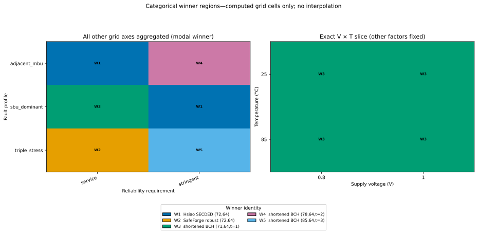
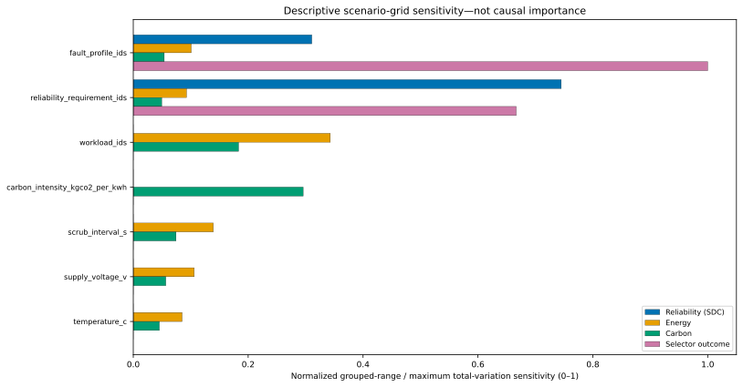

# Scenarios and workloads

The current multi-ECC study is a full Cartesian grid declared in `green_ecc_physical_simulation/registry/scenarios/software-simulation-study-v1.json`. Parameters are materialized and hashed before winners are computed.

## Current grid

| Axis | Values | Meaning/evidence |
|---|---|---|
| Supply voltage | 0.8, 1.0 V | Analytical dynamic-energy scaling |
| Temperature | 25, 85 °C | Analytical leakage multiplier |
| Scrub interval | 1, 3,600 s | Analytical scrub pass frequency |
| Grid carbon intensity | 0.1, 0.7 kgCO₂e/kWh | Operational-carbon scenario input |
| Fault profile | `sbu_dominant`, `adjacent_mbu`, `triple_stress` | Explicit uncalibrated class PMFs |
| Workload | `low_activity`, `high_activity` | Access count and write fraction |
| Reliability requirement | `service`, `stringent` | Hard SDC and DUE limits |

The product is `2×2×2×2×3×2×2 = 192` scenarios. A `scenario_id` is the canonical hash of the study ID and factor tuple; categorical heatmaps display only evaluated cells and never interpolate.

The equal information capacity is 8,388,608 bits. `low_activity` models 10⁶ payload accesses, a 0.1 write fraction and 3,600 s lifetime; `high_activity` uses 10⁹ accesses, a 0.5 write fraction and the same lifetime. These are analytical workloads, not activity traces.

## Reliability constraints

| Requirement | Maximum SDC probability/64-bit access | Maximum DUE probability/64-bit access |
|---|---:|---:|
| `service` | 1×10⁻⁸ | 1×10⁻⁶ |
| `stringent` | 1×10⁻¹² | 1×10⁻⁷ |

An implementation that fails either limit is infeasible before Pareto dominance. Verification rejection is applied even earlier.

## Fault profiles

Each profile assigns per-codeword-access probability to exact functional classes: single, adjacent double, non-adjacent double, adjacent triple and non-adjacent triple. The probabilities are explicit sensitivity inputs with provenance saying they are uncalibrated and not radiation measurements. Adjacency means consecutive encoded-codeword coordinates and never crosses a codeword, word, bank or page boundary.

## Uncertainty cases

Three deterministic scale tuples are reevaluated for all 192 scenarios:

| Model | Bit energy scale | XOR energy scale | Leakage scale |
|---|---:|---:|---:|
| `base` | 1.0 | 1.0 | 1.0 |
| `logic_dominated` | 0.5 | 2.0 | 0.5 |
| `storage_dominated` | 1.5 | 0.5 | 1.5 |

There is one deterministic evaluation per scenario/model and no random sampling, so a seed is not applicable. The study also records value intervals (for example 0.5×–2× analytical energy) as sensitivity metadata; they are not confidence intervals.

*The left panel aggregates exact computed cells by fault/requirement and reports the modal winner; the right is one exact voltage–temperature slice. Data: [`figure_data/winner_region_heatmaps.json`](figure_data/winner_region_heatmaps.json).*

*Grouped-range and winner-distribution total-variation scores describe this grid only; they are not causal importance. Data/method: [`figure_data/sensitivity_ranked.json`](figure_data/sensitivity_ranked.json).*

## Adding or changing a scenario

Create a new versioned scenario manifest rather than overwriting the current preregistered file. Define every axis, fault/workload dictionary, reliability limits, analytical parameters and uncertainty case. Rebuild the catalogue so the preregistration hash changes before running selection. Never tune a parameter after observing a winner without recording a new study identity.
