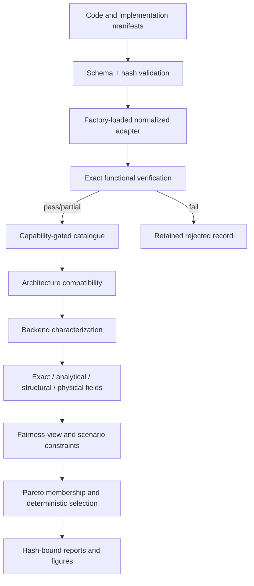
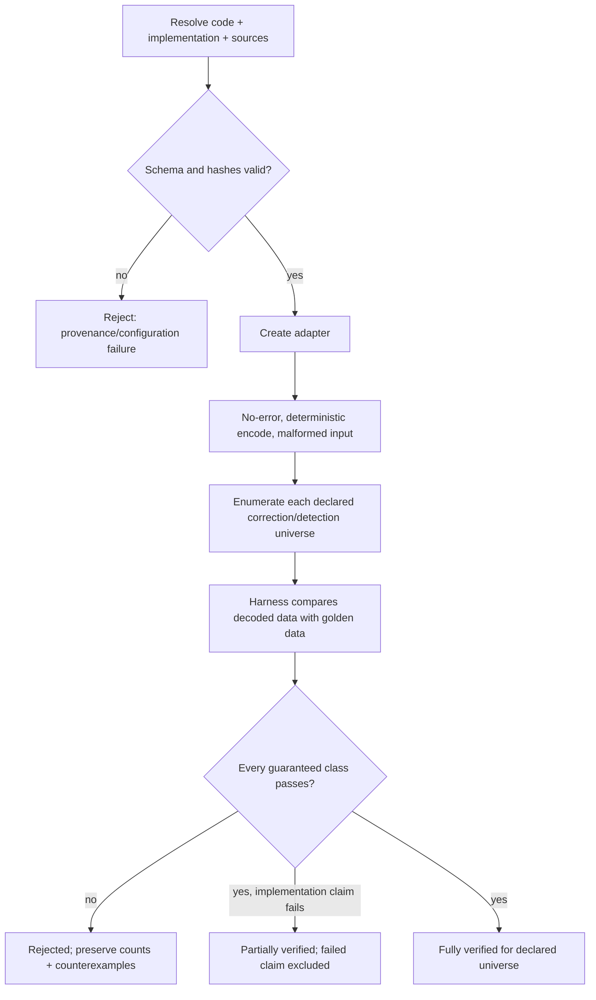
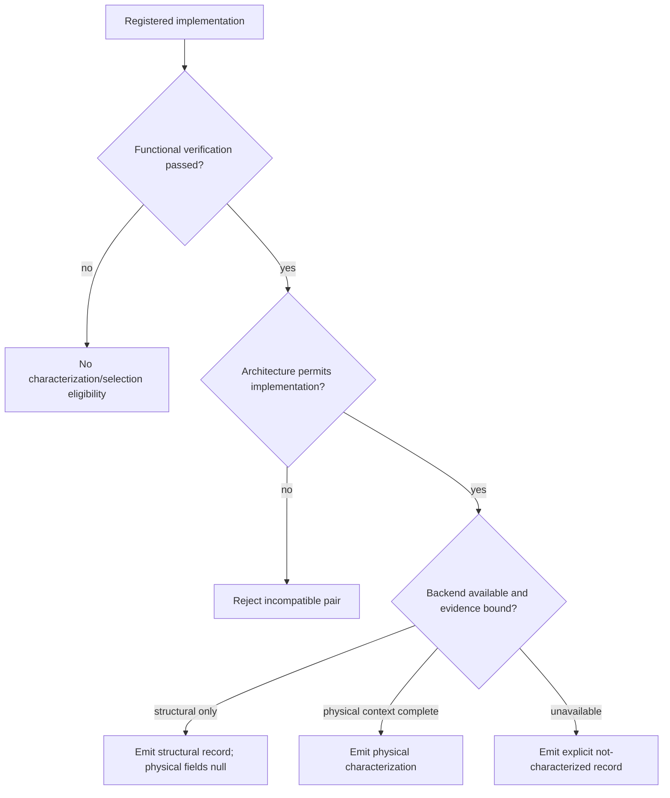
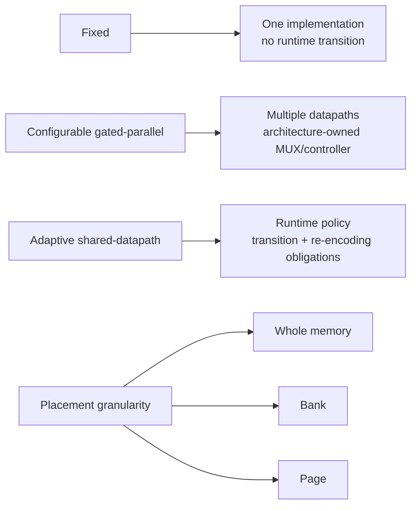
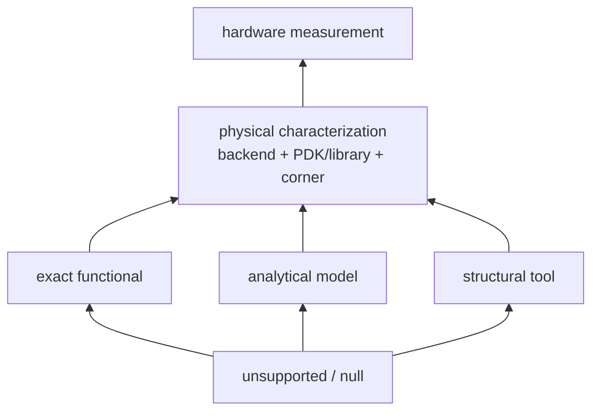

# System architecture

The framework is a sequence of explicit evidence gates rather than one monolithic selector.

## Component map

| Component | Responsibility | Principal files |
|---|---|---|
| CLI integration | Public catalogue, verification, characterization, physical selection and legacy commands | `eccsim.py`, `green_ecc_phy/cli.py` |
| Contracts | `DecodeResult`, status semantics, adapter protocol | `green_ecc_phy/contracts.py` |
| Registry | Schema validation, identity checks, matrix resolution, factory creation | `green_ecc_phy/registry.py`, `green_ecc_phy/loading.py` |
| Adapters | Normalize linear, BCH and external encoders/decoders | `green_ecc_phy/adapters.py`, `green_ecc_phy/bch.py` |
| Verification | Enumerate declared universes, compare golden data, bind hashes/tools | `green_ecc_phy/verification.py` |
| Backends | Null-safe structural/physical result normalization | `green_ecc_phy/backends.py` |
| Comparison | Fairness views and physical-only selection | `green_ecc_phy/comparison.py` |
| Study | Exact profiles, payload normalization, analytical scenario grid, regret/stability | `green_ecc_phy/study.py` |
| Documentation figures | Independent Pareto audit, data export, SVG/PNG/PDF | `green_ecc_phy/pareto_validation.py`, `scripts/generate_documentation_figures.py` |

## Verification gate

## Characterization eligibility

## Deployment architectures

Fixed manifests establish a deployment identity without adaptation cost. Configurable and adaptive forms explicitly own selection logic, MUX/controller cost, state transition, metadata, and possible data re-encoding. Those costs are not measured in the current artifacts; architecture feasibility is therefore unresolved rather than free.

## Evidence hierarchy

The arrows indicate additional prerequisites, not that analytical or structural evidence automatically becomes physical. Evidence classes remain separate fields throughout.
