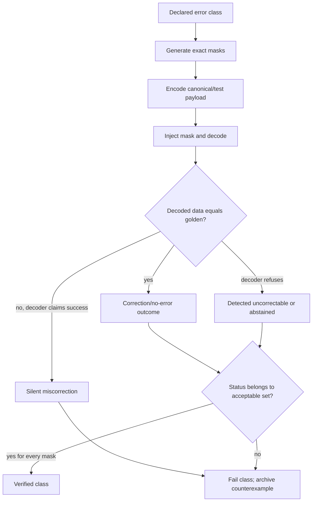
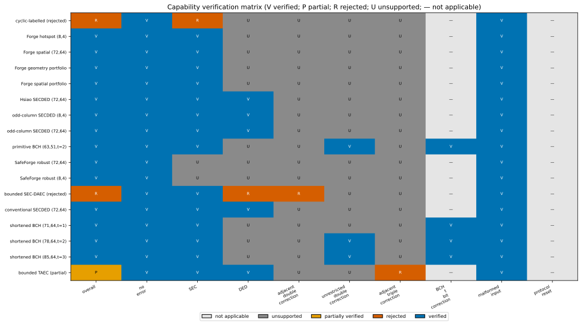
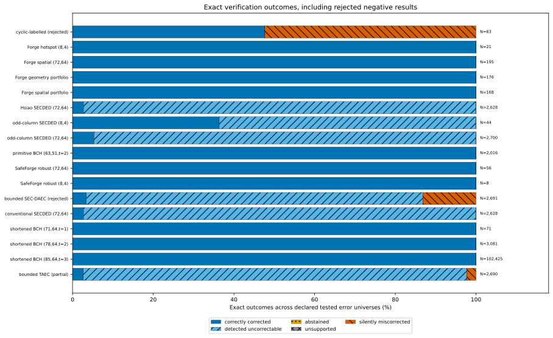

# Verification methodology

Verification establishes what a concrete implementation does over a declared universe. It does not infer guarantees from a family name.

## Normalized decoder result

Every adapter returns a `DecodeResult` from `green_ecc_phy/contracts.py` with decoded `data`, a `DecodeStatus`, syndrome/correction metadata where available, and diagnostics. The relevant statuses are `NO_ERROR`, `CORRECTED`, `DETECTED_UNCORRECTABLE`, `ABSTAINED`, `UNSUPPORTED`, and `INVALID_CONFIGURATION`.

`MISCORRECTED` is deliberately harness-derived: if the decoder reports success (`NO_ERROR` or `CORRECTED`) but its data differs from the known golden payload, the verification harness records a silent miscorrection. A decoder cannot hide this outcome behind a native “corrected” flag.

## Declared and tested universes

An implementation manifest declares error classes with:

- class ID and generator (`all_combinations`, adjacent windows, archived table entries);
- error weight and coordinate count where applicable;
- claim kind (guaranteed correction/detection or implementation-specific correction);
- acceptable statuses;
- a data-independence proof when one canonical dataword stands for every payload.

For linear encoders with a translation-invariant deterministic syndrome policy, outcomes depend on the error mask, so exhaustive masks over a canonical codeword are sufficient. Otherwise, the harness must test enough payloads to establish the claim. The report records `patterns`, `passed_count`, `failure_count`, `exact_fraction`, failed masks, `tested_data_words`, and `tested_universe_hash`.

## Gate order

1. validate manifests, schemas, matrices and source hashes;
2. construct the adapter from its declared factory;
3. check deterministic encoding and no-error decoding;
4. reject malformed encode/decode widths;
5. verify latency/protocol/reset/transition obligations or mark them not applicable;
6. enumerate every declared correction/detection universe;
7. compare decoded data with golden data to derive miscorrection;
8. bind the report to implementation, matrix, test universe, source evidence and tool versions;
9. classify full, partial, or rejected capability status;
10. admit only passing capabilities to later scenario selection.



## Passing example: Hsiao SECDED

Verified locally:

```text
python eccsim.py ecc verify --implementation hsiao-generated-combinational-72-64-v1
```

The report passes 72/72 single-bit correction masks and 2,556/2,556 double-bit detection masks. Stateless combinational protocol/reset checks are `not_applicable`, not missing. The implementation, matrix and tested universe each have a SHA-256 binding. This verifies SECDED behavior only; weight ≥3 remains outside the guarantee.

## Rejected example: bounded SEC-DAEC

Verified locally:

```text
python eccsim.py ecc verify --implementation secdaec-rtl-bounded-72-64-v1
```

Single-bit correction passes 72/72. The universal double-error detection class passes only 2,254/2,556 because 302 masks silently miscorrect. The implementation-specific adjacent-pair correction class passes 10/63 and silently miscorrects 53/63. The full implementation is rejected for selection, while its negative record and masks are preserved.

The bounded TAEC implementation demonstrates partial verification: its shared SECDED universes pass, but its adjacent-triple correction claim fails 62/62. It remains selectable only for capabilities that actually passed.



*Blue “V” cells are verified, orange “P” is partial, red “R” is rejected, grey “U” is unsupported, and a dash is not applicable. Data and hashes: [`figure_data/capability_verification_heatmap.json`](figure_data/capability_verification_heatmap.json).*



*Exact declared-universe outcome proportions include the negative cyclic/BCH-labelled and SEC-DAEC results. Pattern totals, not Monte Carlo samples, appear at right. Data: [`figure_data/error_outcome_distributions.json`](figure_data/error_outcome_distributions.json).*

## Selector eligibility

The scenario study initially selects implementations whose `verification_status` is `passed`. It then evaluates only the capability represented by exact outcome profiles and applies scenario SDC/DUE limits. A rejected record can never re-enter because its analytical objective looks attractive. See [Pareto and Selection](PARETO_AND_SELECTION.md).
