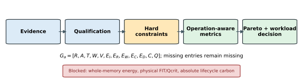
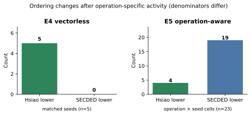
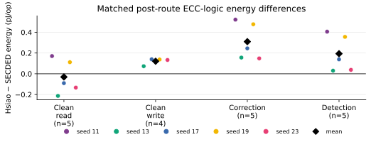
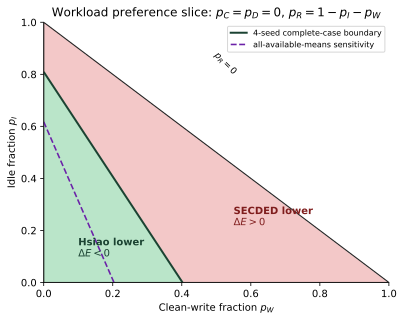

# When Vectorless Power Ordering Does Not Survive Operation-Aware Activity: A Matched Post-Route SRAM-ECC Study

## Abstract

Architecture choices for memory error correction are often compared with reliability guarantees and vectorless physical-design power, although ECC activity differs across reads, writes, correction, and detection. We test whether a vectorless architecture ordering survives operation-specific activity. Two `(72,64)` SECDED implementations—conventional extended Hamming and Hsiao—were placed and routed under a common SKY130HD flow at 10 ns using five matched placement seeds. For each routed netlist, zero-delay gate-level VCD activity was combined with the final SPEF for post-route power estimation. Forty-six records pass the activity, timing, workload, and provenance gates: five matched pairs for clean read, correction, and detection, and four for idle and clean write. Vectorless power favored Hsiao in 5/5 seed pairs; operation-aware energy favored Hsiao in only 4/23 matched operation/seed comparisons. Mean Hsiao-minus-SECDED energy differences are −0.0308 pJ/read, +0.1207 pJ/write, +0.3095 pJ/correction, and +0.1935 pJ/detection. GREEN converts these qualified estimates into constrained Pareto and workload-dependent decisions. The results cover ECC logic, not SRAM macro-internal or whole-memory energy, and do not constitute silicon measurements.

## I. Introduction

An ECC implementation must satisfy a protection requirement, close timing, and fit its physical budget. Its energy cost is less easily reduced to one number. Clean reads exercise checking logic, writes exercise encoding paths, and error-handling reads activate correction or detection logic. Power estimates that do not encode those operation-specific transitions can rank two implementations differently from an activity-annotated analysis. Power estimation has long been known to depend on the switching activity supplied to the estimator [1], while memory-ECC checker optimization has shown that data traces and input correlation affect power [2]. The open question here is narrower: does an architecture preference observed with vectorless post-route power persist when the same routed implementations are evaluated using operation-specific activity?

Hsiao's minimum odd-weight-column SECDED construction reduces parity-matrix weight relative to conventional extended Hamming constructions [3]. Subsequent work optimized Hamming and Hsiao checkers for workload power [2], compared cache-ECC choices across area, access time, and correction capability [4], and constructed codes for lower delay or synthesized cost [5], [6]. Cross-layer memory studies and adaptive schemes likewise trade reliability against power, area, or performance [7]–[9]. These results rule out broad novelty claims for Hsiao coding, workload-aware ECC, or reliability-energy optimization. Our focused literature audit did not identify a matched multi-seed experiment that directly tests a vectorless Hamming/Hsiao ordering against operation-separated final-routed activity with extracted parasitics and an explicit macro-energy boundary. We therefore claim a bounded empirical result, not publication priority.

This paper makes three contributions. First, it formulates GREEN as an evidence-qualified decision sequence: qualify evidence, enforce hard reliability and timing constraints, retain missing quantities, and only then construct operation-aware and Pareto comparisons. Second, it reports a five-seed matched post-route comparison in which a 5/5 Hsiao-lower vectorless tendency persists in only 4/23 operation/seed E5 cells. Third, it derives a workload-dependent energy boundary from the measured operation classes without assigning hidden workload probabilities.

## II. GREEN Methodology

GREEN is the decision method applied to the experiment, not the experiment itself. Figure 1 summarizes its sequence. An architecture (a) is represented by

\[
G_a=[R_a,A_a,T_a,W_a,V_a,E_{I,a},E_{R,a},E_{W,a},E_{C,a},E_{D,a},C_a,Q_a],
\]

where (R) records reliability evidence; (A,T,W,V) are area, timing, wirelength, and via count; (E_I,E_R,E_W,E_C,E_D) are operation energies; (C) contains only qualified carbon quantities; and (Q) records evidence class, provenance, and exclusions. Missing values remain missing. In particular, an absent whole-memory energy or physical FIT is neither zero nor an analytical substitute.

GREEN applies constraints before preferences. For this comparison, an implementation must provide validated SECDED behavior and have setup \(\mathrm{WNS}\ge 0\) at the common 10 ns target. These constraints admit conventional SECDED and Hsiao and exclude the unprotected U0 baseline. The evaluated BCH `(78,64,t=2)` implementation is also excluded because all five inherited 10 ns runs are timing-infeasible. This says nothing about other BCH implementations.

For declared workload probabilities

\[
\mathbf p=(p_I,p_R,p_W,p_C,p_D),\qquad \sum_xp_x=1,
\]

operation-aware ECC-logic energy is

\[
E_a(\mathbf p)=p_IE_{I,a}+p_RE_{R,a}+p_WE_{W,a}+p_CE_{C,a}+p_DE_{D,a}.
\]

The preference is determined by

\[
\Delta E(\mathbf p)=E_{\text{Hsiao}}(\mathbf p)-E_{\text{SECDED}}(\mathbf p).
\]

Hsiao is lower when \(\Delta E<0\); SECDED is lower when \(\Delta E>0\). GREEN accepts either symbolic probabilities or an explicitly declared scenario. It does not infer a deployed workload from the characterization traces. Operational carbon can be evaluated only as \(C_{op,a}=N_{ops}E_a(\mathbf p)CI\) for declared operation count and electricity carbon intensity. Absolute lifecycle carbon additionally requires process-specific embodied carbon, which is unavailable here. This separation follows the lifecycle categories used in semiconductor sustainability studies [10] without implying imec review or endorsement.

Pareto fronts use only jointly qualified quantities. Both admitted architectures lie on the architecture-mean `{area, setup WNS, clean-read energy}` front: conventional SECDED has lower area, whereas Hsiao has higher mean WNS and slightly lower mean clean-read energy. Whole-memory energy, physical FIT, Qcrit, and absolute lifecycle carbon are barred from fronts.

## III. Experimental Methodology

We compare conventional extended-Hamming SECDED and Hsiao SECDED wrappers storing 256 64-bit payload words with eight check bits. Fresh functional regressions enumerate all single-bit correction and double-bit detection masks over four deterministic payloads; frozen exact evidence supplies the code-level interpretation. These are coding/RTL results, not physical soft-error rates. The physical flow uses SKY130HD at TT, 1.80 V, and 25 °C. Five placement/routing seeds—11, 13, 17, 19, and 23—are matched between architectures. All ten fresh RTL-to-GDSII runs meet the common 10 ns setup constraint. The pinned flow records Yosys, OpenROAD-flow-scripts, OpenROAD, and OpenSTA revisions; the open-source flow lineage is described by Ajayi et al. [11].

For each final routed gate netlist, deterministic testbenches generate five classes: idle, clean write, clean read, read with one injected payload-bit error and correction, and read with two injected payload-bit errors and detection. After 16 warm-up cycles, exactly 256 operations are characterized per class. Activity comes from zero-delay simulation of the final routed netlist. VCD-resolved top-level activity is supplemented with exact same-named routed-net activity; the power pass loads the final SPEF. Functional-logic annotation coverage is 99.298%–99.356%, and every qualified record includes all 72 required SRAM-output roots.

Forty-six operation records pass the fail-closed E5 gates. All five seed pairs qualify for clean read, correction, and detection; four qualify for idle and clean write because seed 11 fails the activity qualification for those two classes. Each record includes internal, switching, leakage, total power, and operation-normalized energy. The SRAM Liberty views contain leakage and partial clock/control internal-power groups but do not establish address-, data-, and state-dependent macro-internal energy. Accordingly, the reported quantity is **post-route ECC-logic energy estimated using extracted parasitics and annotated switching activity**. Whole-memory energy is not qualified.

Statistics treat placement seeds as matched implementation replications. We report every paired value, mean, median, sample standard deviation, extrema, and ordering count in the artifact package. Deterministic paired bootstrap intervals and leave-one-seed-out means are sensitivity summaries; five seeds do not support a large-population claim, and we make no claim of statistical significance.

## IV. Results and Discussion

### A. Physical comparability and vectorless ordering

Both implementations close 10 ns in all five seeds. Relative to conventional SECDED, Hsiao adds a mean 237.6 µm² of total instance area, 237.2 µm² of standard-cell area, 2992.8 µm of wire, and 467.8 vias; every paired difference is positive. Its setup WNS is higher by 0.2437 ns on average and in four seeds, with seed 13 lower by 0.0997 ns. The result is a physical tradeoff, not “better PPA.” Hsiao uses more placed/routed resources while often retaining more setup slack.

The inherited E4 diagnostic estimates vectorless post-route power on these matched designs. Hsiao is lower in all five pairs, with a mean total-power difference of approximately −0.3147 mW. E4 therefore supports a Hsiao-lower tendency only under its vectorless activity model. It does not establish operation energy.

### B. E4-to-E5 ordering change

Figure 2 separates the two denominators. E4 contributes five seed-level power comparisons. E5 contributes 23 qualified operation-by-seed comparisons: four idle, five clean read, four clean write, five correction, and five detection. Hsiao is lower in only four E5 cells. Thus the Hsiao-lower vectorless tendency is not generally preserved after operation-specific activity is introduced. This result does not mean vectorless analysis is intrinsically wrong; it establishes that this vectorless ordering is not stable under the evaluated workload classes.

### C. Operation-level energy

Figure 3 shows every matched energy difference. Clean read has mean \(\Delta E_R=-0.0308\) pJ/op, but the individual result is Hsiao-lower in only three of five seeds. Clean write has mean \(\Delta E_W=+0.1207\) pJ/op and favors SECDED in all four qualified pairs. Correction has the largest mean separation, \(\Delta E_C=+0.3095\) pJ/op, and favors SECDED in all five pairs. Detection gives \(\Delta E_D=+0.1935\) pJ/op and also favors SECDED in all five. The consistency of write, correction, and detection is stronger evidence within this sample than their means alone; the clean-read exception rate prevents an unconditional Hsiao read claim.

The clean-read component decomposition clarifies what the measurements contain. Hsiao switching power is lower in 5/5 pairs, while Hsiao internal power is higher in 5/5; leakage differences are positive and much smaller. The combined energy is Hsiao-lower in 3/5. The component-level decomposition is consistent with a switching reduction being partly or fully offset by internal power. The experiment does not isolate cell arcs or logic cones, so it does not establish why those components change.

Leave-one-seed-out analysis preserves the positive mean for write, correction, and detection under every omission. The clean-read mean is less stable: its sign and magnitude depend on the retained seeds, and the paired bootstrap interval spans zero. These summaries describe the five implemented seeds; they are not a claim about a manufacturing or workload population.

### D. Workload-dependent GREEN boundary

The four seeds with all five qualified classes define a joint operation vector. In pJ/op,

\[
\Delta E_4(\mathbf p)=0.019108p_I-0.081182p_R+0.120682p_W+0.256536p_C+0.140507p_D.
\]

Therefore Hsiao is lower only when

\[
p_R>\frac{0.019108p_I+0.120682p_W+0.256536p_C+0.140507p_D}{0.081182}.
\]

This is the analytical preference boundary; the probabilities remain user-declared. Figure 4 shows the readable slice \(p_C=p_D=0\), \(p_R=1-p_I-p_W\). The complete-case boundary is \(0.100290p_I+0.201864p_W<0.081182\). A dashed sensitivity boundary uses each operation's full available sample; its clean-read coefficient is −0.0308 pJ/op rather than the four-seed −0.0812 pJ/op. The visible separation between boundaries is a direct warning that four to five seeds do not justify a precise deployed-workload crossover.

When timing is a constraint and the front contains only area and workload energy, SECDED dominates Hsiao for endpoint classes with positive \(\Delta E\); both remain nondominated for clean read because SECDED has lower area and Hsiao lower mean energy. When setup WNS is retained as a maximized objective, both architectures remain nondominated at the architecture-mean level. GREEN consequently returns workload- and objective-dependent alternatives. It does not return a global winner.

## V. Limitations and Conclusion

The experiment establishes one implementation-scoped result: across five matched 10 ns routes, a Hsiao-lower vectorless ordering in 5/5 seed pairs is retained in only 4/23 operation-aware ECC-logic comparisons. Write, correction, and detection favor SECDED in every qualified seed; clean read is mixed. Hsiao also uses more area, wirelength, and vias while often having more setup slack.

The boundary is explicit. E5 covers only conventional SECDED and Hsiao at 10 ns, with five matched seeds and no U0 or BCH E5 point. BCH's exclusion follows the evaluated implementation's 10 ns timing failure, not a family limit. The power values depend on one open-source flow, PVT corner, zero-delay routed-netlist activity, deterministic operation traces, and EDA models; they are not silicon measurements. Missing SRAM macro-internal characterization blocks whole-memory energy. Reliability is restricted to coding-theoretic and regression-validated correction/detection behavior; no physical FIT, SDC, DUE, Qcrit, or interleaver result is claimed. Operational carbon remains a declared-(CI) scenario derived from the same ECC-logic boundary, and absolute lifecycle-carbon comparison is outside the qualified evidence. These limits do not require another experiment for the stated research question; they require the conclusion to remain this narrow.

## References

[1] F. N. Najm, “Transition density: A new measure of activity in digital circuits,” *IEEE Trans. CAD*, vol. 12, no. 2, pp. 310–323, 1993, doi: 10.1109/43.205010.

[2] S. Ghosh, S. Basu, and N. A. Touba, “Reducing power consumption in memory ECC checkers,” in *Proc. International Test Conference*, pp. 1322–1331, 2004, doi: 10.1109/TEST.2004.1387407.

[3] M. Y. Hsiao, “A class of optimal minimum odd-weight-column SEC-DED codes,” *IBM Journal of Research and Development*, vol. 14, no. 4, pp. 395–401, 1970, doi: 10.1147/rd.144.0395.

[4] D. Rossi, N. Timoncini, M. Spica, and C. Metra, “Error correcting code analysis for cache memory high reliability and performance,” in *Proc. DATE*, pp. 1620–1625, 2011, doi: 10.1109/DATE.2011.5763257.

[5] P. Reviriego, S. Pontarelli, J. A. Maestro, and M. Ottavi, “A method to construct low delay single error correction codes for protecting data bits only,” *IEEE Trans. CAD*, vol. 32, no. 3, pp. 479–483, 2013, doi: 10.1109/TCAD.2012.2226585.

[6] S. Tripathi, J. Jana, and J. Bhaumik, “Design of SEC-DED and SEC-DED-DAEC codes of different lengths,” arXiv:2002.07507, 2020.

[7] Z. Pajouhi, X. Fong, and K. Roy, “Device/circuit/architecture co-design of reliable STT-MRAM,” in *Proc. DATE*, pp. 1437–1442, 2015, doi: 10.7873/DATE.2015.0145.

[8] X. Wei, H. Yue, and J. Tan, “LAD-ECC: Energy-efficient ECC mechanism for GPGPU register file,” in *Proc. DATE*, pp. 1127–1132, 2020, doi: 10.23919/DATE48585.2020.9116503.

[9] Y. S. Lee, G. Koo, Y.-H. Gong, and S. W. Chung, “Stealth ECC: A data-width aware adaptive ECC scheme for DRAM error resilience,” in *Proc. DATE*, pp. 382–387, 2022, doi: 10.23919/DATE54114.2022.9774775.

[10] M. Garcia Bardon *et al.*, “DTCO including sustainability: Power-performance-area-cost-environmental score analysis for logic technologies,” in *Proc. IEDM*, 2020, doi: 10.1109/IEDM13553.2020.9372004.

[11] T. Ajayi *et al.*, “Toward an open-source digital flow: First learnings from the OpenROAD project,” in *Proc. DAC*, pp. 1–4, 2019, doi: 10.1145/3316781.3326334.
